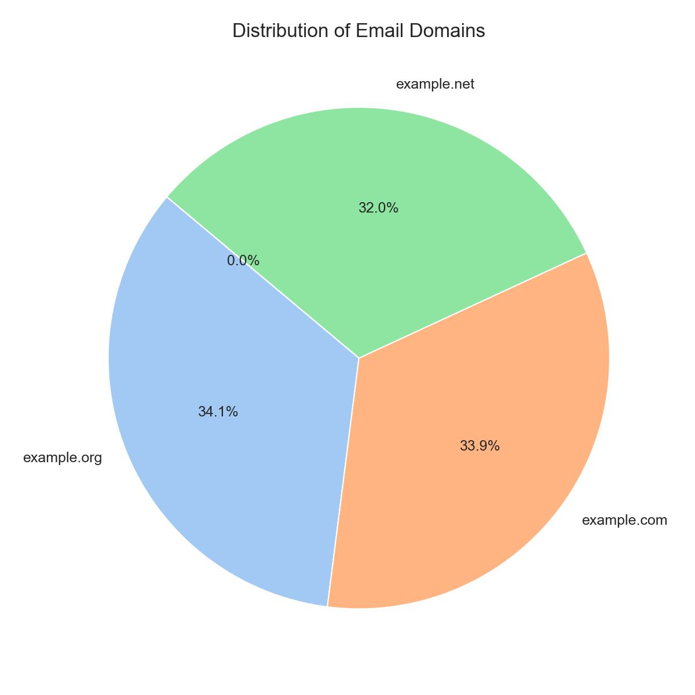
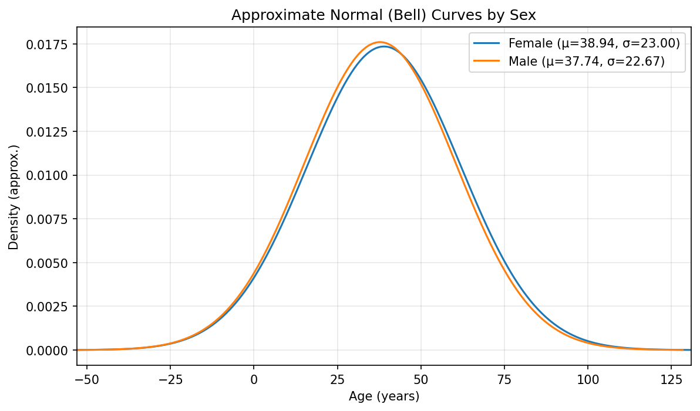
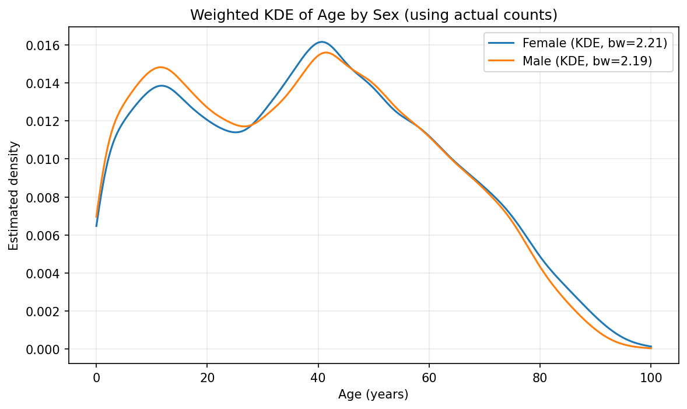
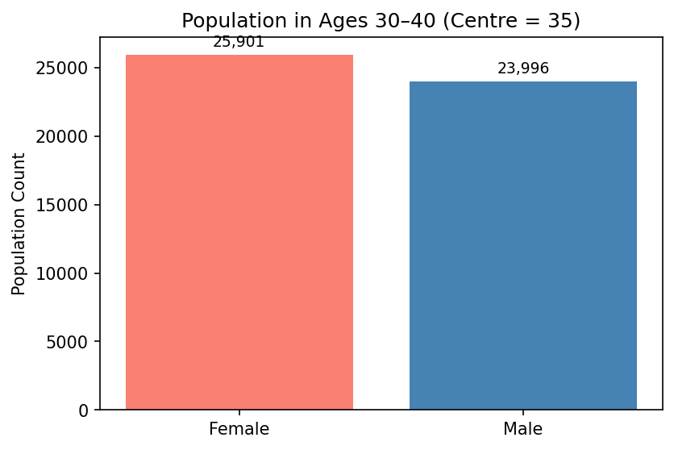
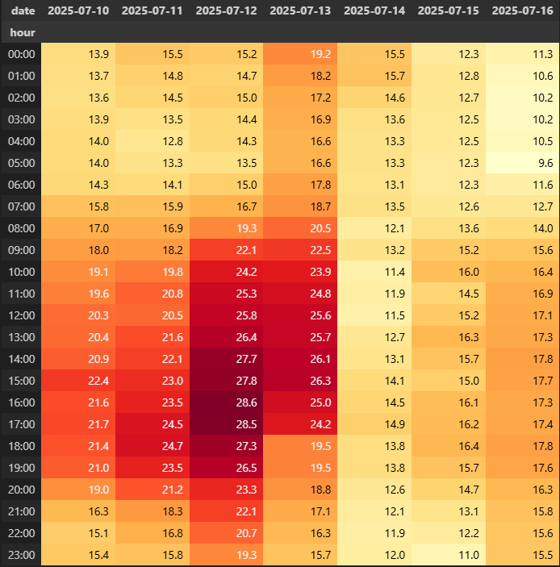
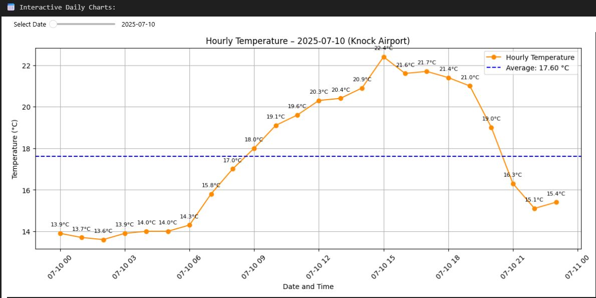
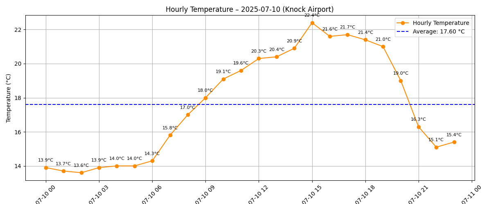
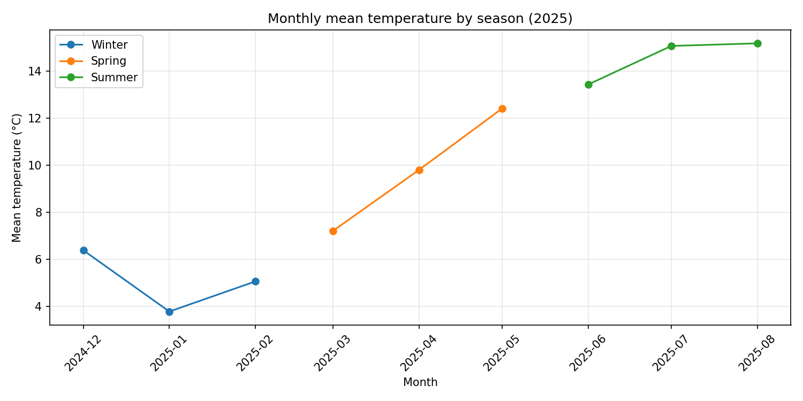
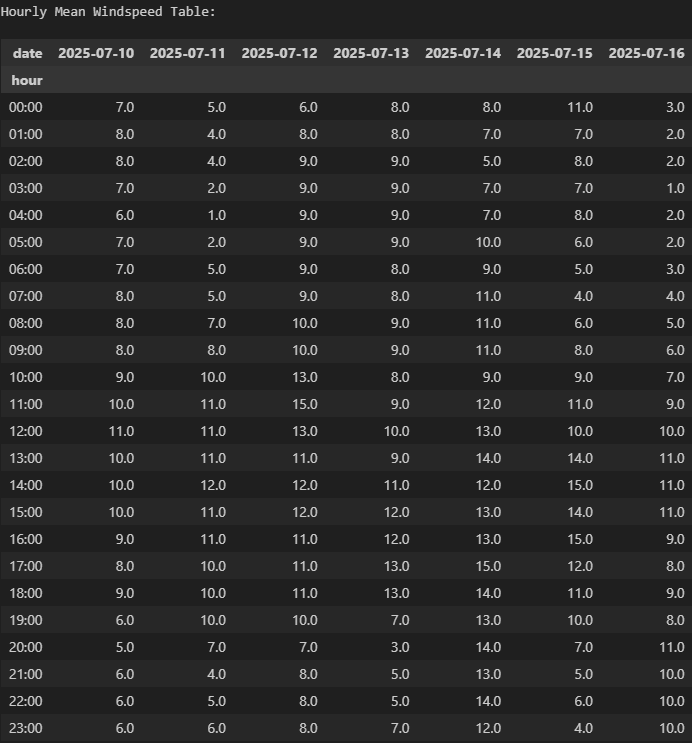

## 🧮 Programming For Data Analytics Module – 2025/2026

Welcome to Edward Cronin’s repository for the Programming For Data Analytics module. This repository contains submissions for assigned tasks, a comprehensive final project, and additional practice work completed during the academic year.

---

## 📁 Repository Structure

This repository is organised into three main sections:

- **Assignments 2025/2026**  
  Includes all formally assessed tasks from the module, demonstrating applied skills in data analysis, visualisation, and Python programming.

- **Final Project 2025/2026**  
  Integrates concepts from across the module into a single, cohesive analysis project.

- **MyWork 2025/2026**  
  Contains exploratory and practice notebooks not submitted for assessment, but useful for demonstrating progress and experimentation.

---

## 👤 Author

- **Name:** Edward Cronin  
- **Student ID:** g00425645  
- **Email:** g00425645@atu.ie

---

## 📥 How to Download This Repository

To download and run the code:

1. Visit [Edward Cronin’s Programming For Data Analytics repository](https://github.com/ECronin1973/programming-for-data-analytics)
2. Click the green **Code** button and select **Download ZIP**
3. Extract the ZIP file locally
4. Ensure Python is installed before running any scripts or notebooks

---

## 📜 Code of Conduct

A code of conduct is included in the repository to guide respectful collaboration and responsible use. Reviewers and contributors are encouraged to follow its principles.

---

## 🧠 Coding Guidelines and References

This repository follows established best practices for coding, documentation, and reproducibility in computational notebooks:

- **Jupyter Best Practices**  
  Narrative text explains the rationale behind each step, with references included where appropriate.  
  🔗 [Jupyter.org/practices](https://jupyter.org/practices)

- **The Turing Way**  
  Emphasises documenting *why* decisions were made, not just *what* was done.  
  🔗 [The Turing Way](https://the-turing-way.netlify.app/reproducible-research/overview/overview.html)

- **Diátaxis Documentation Framework**  
  Encourages separating conceptual documentation (why) from procedural steps (how), with background placed in README files.  
  🔗 [Diátaxis](https://diataxis.fr/)

- **PEP 8 – Python Style Guide**  
  Promotes clear, readable code and consistent commenting. Markdown cells in notebooks serve as the narrative layer.  
  🔗 [PEP 8](https://peps.python.org/pep-0008/)

---

## 🏛️ Assignment 02 – Bank Holidays (Part A)

### Display All Bank Holidays

This task involves writing a Python script that connects to the UK Government’s public API to retrieve a list of bank holidays. The script focuses on holidays listed under Northern Ireland, although some of these dates may also be shared with other UK regions such as England, Wales, or Scotland.

#### Learning Objectives

- Interact with a RESTful API using Python and the `requests` library
- Parse JSON responses and extract structured data
- Filter and display region-specific information
- Format terminal output for clarity and readability

#### Source File

`assignment02-bankholidays.py`

#### Run the program using Python:

```python
python assignment02-bankholidays.py
```

#### Sample Output

```plaintext
Bank Holidays in Northern Ireland:
2026-03-17 - St Patrick’s Day
2026-07-13 - Battle of the Boyne (Orangemen’s Day)
```

## 🏛️ Assignment 02 – Bank Holidays (Part B)

### Display bank Holidays Unique to Northern Ireland

This task builds on Part A by enhancing the script to identify bank holidays that are **exclusive to Northern Ireland** — those not observed in England, Wales, or Scotland. It demonstrates how to compare datasets across regions and apply conditional logic to filter unique entries.

## 🎯 Learning Objectives

By completing this task, users will learn to:

- Compare structured data across multiple regions
- Apply set logic to identify unique values
- Implement conditional filtering in Python
- Display filtered results clearly in the terminal

## 📁 Source File

This script is saved as:  
`assignment02-bankholidays-ni.py`

#### Run the program using Python:

```python
python assignment02-bankholidays-ni.py
```

#### Sample Output

When the script is executed, it should print a list of unique bank holidays in Northern Ireland that are not observed in England/Wales or Scotland.

```plaintext
Unique Bank Holidays in Northern Ireland:
2024-03-18 - St. Patrick's Day
2024-07-12 - Battle of the Boyne (Orangemen's Day)
2025-03-17 - St. Patrick's Day
2025-07-14 - Battle of the Boyne (Orangemen's Day)
2026-03-17 - St. Patrick's Day
2026-07-13 - Battle of the Boyne (Orangemen's Day)
2027-03-17 - St. Patrick's Day
2027-07-12 - Battle of the Boyne (Orangemen's Day)
```

## Further Reading and References

To help complete assignment 02 Part A and Part B, I used the following resources to learn how to work with JSON data and APIs in Python, and to compare data across multiple regions for identifying unique holidays (Part B):

- **ATU Lecture: Representing Data**  
  I watched the lecture in [25-26: 4369 -- Programming For Data Analytics](https://vlegalwaymayo.atu.ie/course/view.php?id=12815) to understand how data like JSON is used in programming and how APIs provide structured data. This helped with both retrieving the data (Part A) and comparing it across regions (Part B).

- ATU Assignment 2 Instructions
  I followed the assignment instructions provided in [Assignment 2](https://vlegalwaymayo.atu.ie/mod/page/view.php?id=1204016) to complete the task of extracting bank holidays for Northern Ireland and comparing them with those in England/Wales and Scotland.

- **ATU Lab: Topic 01 – Representing Data**  
  I followed the lab exercises in [Lab 01 Datarepresentation.pdf](https://vlegalwaymayo.atu.ie/pluginfile.php/1590492/mod_url/intro/Lab%2001%20Datarepresentation.pdf?time=1759329869806), which showed how to read JSON from the internet using Python. This was useful for accessing and printing data in Part A, and for understanding how to loop through and filter data in Part B.

- **JSON Format – json.org**  
  I used [json.org](https://www.json.org/json-en.html) to learn the basic structure of JSON, including how data is stored in key-value pairs and nested lists. This helped me understand how to navigate and compare JSON structures across different UK regions.

- **gov.uk Bank Holidays API**  
  I explored the [gov.uk bank holidays JSON feed](https://www.gov.uk/bank-holidays.json) to see how the data is organized and where to find the holidays for Northern Ireland, England and Wales, and Scotland. This was essential for comparing holiday titles and identifying which ones are unique to Northern Ireland in Part B.

- **Python Requests Library**  
  I read the [requests library documentation](https://pypi.org/project/requests/) to understand how to fetch data from a website using Python. This was used to retrieve the JSON data needed for both parts of the assignment.

- **W3Schools – Python JSON Tutorial**  
  I used [W3Schools](https://www.w3schools.com/python/python_json.asp) to learn how to convert JSON into Python dictionaries and loop through the data. This helped with extracting and comparing holiday titles across regions.

- **Real Python – API Guide**  
  I read [Real Python’s API guide](https://realpython.com/api-integration-in-python/) to learn good practices for working with APIs, including how to handle errors, validate responses, and format output clearly. This was especially helpful in making the script more robust and readable for both parts of the assignment.

## References

- [25-26: 4369 -- PROGRAMMING FOR DATA ANALYTICS MODULE](https://vlegalwaymayo.atu.ie/course/view.php?id=12815)
- [Lab 01 Datarepresentation.pdf](https://vlegalwaymayo.atu.ie/pluginfile.php/1590492/mod_url/intro/Lab%2001%20Datarepresentation.pdf?time=1759329869806)
- [json.org](https://www.json.org/json-en.html)
- [gov.uk bank holidays API](https://www.gov.uk/bank-holidays.json)
- [requests library documentation](https://pypi.org/project/requests/)
- [W3Schools Python JSON guide](https://www.w3schools.com/python/python_json.asp)
- [Real Python’s guide to working with APIs](https://realpython.com/api-integration-in-python/)

# END

---

## 🏛️ Assignment 03 – Email Domain Analysis (Pie Chart)

This notebook explores a dataset of 1,000 individuals to identify and visualise the most common email domains. It demonstrates how to extract domain names from email addresses, compute frequency counts, and generate a pie chart using Python libraries. Less frequent domains are grouped into an “Others” category to improve readability and visual clarity.

## 🎯 Learning Objectives

By completing this notebook, users will learn to:

- Load and inspect structured CSV data using pandas
- Extract domain names from email addresses using string operations
- Count domain frequencies and group low-frequency entries
- Generate and save a pie chart visualisation using matplotlib and seaborn

## 📁 Source Files

| File Path | Description |
|-----------|-------------|
| `assignments/notebooks/assignment03-pie.ipynb` | Main notebook for Assignment 03. Loads the dataset, extracts email domains, counts them, and creates a pie chart. |
| `assignments/data/people.csv` | Dataset of 1,000 individuals. The `Email` column is used to extract domain names. |

## 🧭 Implementation Approach

The notebook is implemented in modular steps:

### 1. **Load Dataset**
- Read `people.csv` into a pandas DataFrame
- Confirm presence of the `Email` column

**Why:**  
Loading the dataset into a DataFrame enables efficient manipulation and analysis. Verifying structure ensures robustness before processing.  
🔗 [pandas documentation](https://pandas.pydata.org/)


### 2. **Extract Email Domains**
- Split each email address at the `@` symbol
- Retain the domain portion (e.g. `example.org`)

**Why:**  
Domain extraction is a common string operation in data cleaning. It enables grouping by organisation or provider.  
🔗 [Python string methods](https://docs.python.org/3/library/stdtypes.html#string-methods)


### 3. **Count Domain Frequencies**
- Use `value_counts()` to tally domain occurrences
- Identify top domains and group others

**Why:**  
Frequency counts reveal dominant providers. Grouping less frequent domains into “Others” improves visual clarity.  
🔗 [pandas Series.value_counts](https://pandas.pydata.org/docs/reference/api/pandas.Series.value_counts.html)


### 4. **Generate Pie Chart**
- Plot top domains using `matplotlib` and `seaborn`
- Style chart for accessibility and save as JPG

**Why:**  
Pie charts are effective for showing proportional distribution. Saving the chart ensures reproducibility and supports reviewer access.  
🔗 [matplotlib pie chart guide](https://matplotlib.org/stable/gallery/pie_and_polar_charts/pie_features.html)


### 5. **Run the Notebook**

To execute the notebook:

```bash
cd assignments/notebooks
jupyter notebook assignment03-pie.ipynb
```

**Example output**

- Below is a sample of the first 10 rows from people.csv:

Sample of the data (`assignments/data/people.csv`) — first 10 rows (columns shown):

```
Index,User Id,First Name,Last Name,Sex,Email,Phone,Date of birth,Job Title
1,8717bbf45cCDbEe,Shelia,Mahoney,Male,pwarner@example.org,857.139.8239,2014-01-27,Probation officer
2,3d5AD30A4cD38ed,Jo,Rivers,Female,fergusonkatherine@example.net,+1-950-759-8687,1931-07-26,Dancer
3,810Ce0F276Badec,Sheryl,Lowery,Female,fhoward@example.org,(599)782-0605,2013-11-25,Copy
4,BF2a889C00f0cE1,Whitney,Hooper,Male,zjohnston@example.com,+1-939-130-6258,2012-11-17,Counselling psychologist
5,9afFEafAe1CBBB9,Lindsey,Rice,Female,elin@example.net,(390)417-1635x3010,1923-04-15,Biomedical engineer
6,aF75e6dDEBC5b66,Sherry,Caldwell,Male,kaitlin13@example.net,8537800927,1917-08-06,Higher education lecturer
7,efeb05c7Cc94EA3,Ernest,Hoffman,Male,jeffharvey@example.com,093.655.7480x7895,1984-12-22,Health visitor
8,fb1BF3FED57E9d7,Doris,Andersen,Male,alicia33@example.org,4709522945,2016-12-02,Air broker
9,421fAB9a3b98F30,Cheryl,Mays,Male,jake50@example.com,013.820.4758,2012-12-16,"Designer, multimedia"
10,4A42Fe10dB717CB,Harry,Mitchell,Male,lanechristina@example.net,(560)903-5068x4985,1953-06-29,Insurance account manager
```

### Pie Chart Output

The pie chart below visualises the distribution of the top email domains found in the dataset. Less frequent domains are grouped into an “Others” slice.



### References

References
ATU Lecture: Acquiring data I watched the lecture in [25-26: 4369 -- Programming For Data Analytics](https://vlegalwaymayo.atu.ie/course/view.php?id=12815) to understand how to acquire data from various sources, including downloading datasets from the web. This helped me understand the importance of data acquisition in data analytics.

ATU Assignment 3 Instructions I followed the assignment instructions provided in Assignment 3 to complete the task of extracting email domains and visualizing them using a pie chart. The instructions guided me through the steps of data extraction, processing, and visualisation.

[assignment03-pie.ipynb](assignments/notebooks/assignment03-pie.ipynb)
Main notebook for Assignment 3. It loads the dataset, extracts email domains, counts them, and creates a pie chart.

[people.csv](assignments/data/people.csv)
Dataset of 1,000 people. The Email column is used to extract domain names for analysis.

[pandas](https://pandas.pydata.org/)
Used to load the dataset (read_csv), extract email domains from strings (str.split), and count how often each domain appears (value_counts).

[matplotlib](https://matplotlib.org/)
Used to create and customize the pie chart (plot.pie), adjust layout (tight_layout), display the chart (show), and save it as an image file (savefig).

[seaborn](https://seaborn.pydata.org/)
Used to apply a pastel color palette for the pie chart (color_palette) to improve visual clarity and style.

END
---

# 📊 Assignment 05 – Population Analysis by Sex and Age

This assignment explores population data by sex and single year of age using official census statistics. It demonstrates how to clean, transform, and analyse demographic data using Python and pandas, with a strong emphasis on clarity, reproducibility, and pedagogical structure.

## Task A: 
Write a jupyter notebook that analyses the differences between the sexes by age in Ireland. 
- Weighted mean age (by sex) 
- The difference between the sexes by age 

This part does not need to look at the regions.

## 🎯 Learning Objectives

This assignment part will:

- Load and clean raw CSV data using pandas
- Pivot data to compare population counts by sex across age groups
- Compute weighted statistics (mean, median, standard deviation)
- Visualise distributions using parametric bell curves and kernel density estimation (KDE)
- Export analysis-ready tables for downstream use or review

---

## 🧰 Notebook Loader & Helper Functions

This notebook uses a modular design with clearly separated helper blocks to support clarity, reusability, and reviewer understanding. These helpers are defined at the top of the notebook and are reused throughout the analysis cells below.

Functions are described and documented inline in `notebooks/assignment05-population.ipynb`.

> 📚 *“Functions help break our program into smaller and modular chunks.”* — [GeeksforGeeks](https://www.geeksforgeeks.org/python-functions/)  
> 🧠 *“Functional decomposition improves clarity and supports reuse.”* — [Python.org](https://docs.python.org/3/howto/functional.html)  
> 🛠️ *“Clean, idiomatic Python code often relies on small, focused helper functions.”* — *Python Cookbook*, 3rd Ed., O’Reilly


### 📤 Utility: Save and Display Plots

- **Purpose**: Centralises logic for saving figures to disk and displaying them inline.
- **Why it matters**: Ensures consistent output format, resolution, and reproducibility across all visualisations.
- **Source**: [matplotlib.pyplot.savefig](https://matplotlib.org/stable/api/_as_gen/matplotlib.pyplot.savefig.html)

### 📁 I/O & Loader Helpers

- **Purpose**: Handle robust file loading and saving using canonical paths (e.g. `DATA_DIR`).
- **Why it matters**: Supports reproducibility and avoids hardcoded paths. These helpers also check for in-memory data before falling back to disk.
- **Source**: [pathlib.Path](https://docs.python.org/3/library/pathlib.html), [pandas.read_csv](https://pandas.pydata.org/docs/reference/api/pandas.read_csv.html)

### 📐 Statistical Computation Helper

- **Purpose**: Performs reusable statistical calculations (e.g. weighted mean, standard deviation).
- **Why it matters**: Keeps analysis cells clean and focused on interpretation rather than computation.
- **Source**: [pandas.DataFrame.apply](https://pandas.pydata.org/docs/reference/api/pandas.DataFrame.apply.html), [numpy.average](https://numpy.org/doc/stable/reference/generated/numpy.average.html)

### 📊 Plotting Helpers (Parametric and KDE)

- **Purpose**: Generate consistent visualisations such as bar charts, KDE plots, and annotated summaries.
- **Why it matters**: Promotes visual clarity and ensures all plots follow a consistent style and layout.
- **Source**: [seaborn.kdeplot](https://seaborn.pydata.org/generated/seaborn.kdeplot.html), [matplotlib.pyplot.bar](https://matplotlib.org/stable/api/_as_gen/matplotlib.pyplot.bar.html)

### 📌 Display Helper: Show Top-N Ages by Sex

- **Purpose**: Displays a compact preview of the top N age rows for each sex.
- **Why it matters**: Keeps notebook outputs readable and helps reviewers quickly inspect key data slices.
- **Source**: [pandas.DataFrame.sort_values](https://pandas.pydata.org/docs/reference/api/pandas.DataFrame.sort_values.html), [pandas.DataFrame.head](https://pandas.pydata.org/docs/reference/api/pandas.DataFrame.head.html)

### 📥 Loader: Tidy Age-Difference CSV (Robust Path Handling)

- **Purpose**: Loads the cleaned age-by-sex dataset from disk or memory, normalises column types, and ensures consistent structure.
- **Why it matters**: Enables downstream analysis cells to work reliably without repeating cleaning logic.
- **Source**: [pandas.read_csv](https://pandas.pydata.org/docs/reference/api/pandas.read_csv.html), [pandas.Series.astype](https://pandas.pydata.org/docs/reference/api/pandas.Series.astype.html)

### 🗺️ Helper: build age-difference CSV including Administrative Counties

- **Purpose**: Constructs a tidy CSV file showing population differences by age and sex, including administrative county breakdowns.
- **Why it matters**: Provides a reusable dataset for further analysis or visualisation tasks.
- **Source**: [pandas.DataFrame.to_csv](https://pandas.pydata.org/docs/reference/api/pandas.DataFrame.to_csv.html)

---

### 🧠 Why This Structure?

Separating helpers from analysis cells allows the notebook to be:

- Easier to maintain and extend
- More readable for students and reviewers
- Reusable across multiple assignments or datasets

Each analysis cell below calls these helpers to perform specific tasks (e.g. comparing sexes in an age band, plotting distributions, identifying regional differences), keeping the workflow modular and pedagogically clear.

---

## 📁 Source File

This notebook is located at:  
[assignment05-population.ipynb](https://github.com/ECronin1973/programming-for-data-analytics/blob/main/assignments/notebooks/assignment05-population.ipynb)

## 🧹 Data Cleaning Steps

The raw dataset is cleaned by:

- Dropping metadata columns not required for analysis
- Filtering to retain only 'Male' and 'Female' rows
- Standardising age labels (e.g. converting 'Under 1 year' to `0`)
- Removing non-numeric age entries and converting types
- Ensuring all population counts are integers

## 📈 Pivot Table Creation

A pivot table is created with:

- Rows: Single year of age
- Columns: Sex ('Male', 'Female')
- Values: Population counts

This structure allows for direct comparison of male and female population counts across age groups.

## 🧮 Statistical Analysis

The notebook computes:

- **Weighted Mean Age**: Average age weighted by population count
- **Weighted Standard Deviation**: Spread of ages around the weighted mean
- **Weighted Median Age**: Age at which half the population is younger and half is older

Each statistic is calculated per sex and saved to CSV for reproducibility.

## 🔍 KDE and Bell Curve Visualisation

Two visualisations are provided:

- **Parametric Bell Curve**: Approximates a normal distribution using weighted mean and standard deviation
- **Kernel Density Estimate (KDE)**: Smoothed density based on actual age counts, without assuming normality

Plots are saved as PNG files and designed for clarity and accessibility.

### Visual outputs

Below are the two main plot outputs produced by the notebook (also saved to `assignments/data/`). These images are embedded here so reviewers can see the results without opening the notebook.



_Parametric bell curves generated using the weighted mean (μ) and weighted standard deviation (σ) for each sex. Useful for a concise, parametric comparison but assumes normality._



_Weighted KDE computed from the single-year age counts; this non-parametric curve reveals the actual shape of the distribution (skew, modes, tails) that a simple bell curve may miss._

Interpretation (short): use the KDE as the primary visual check for the real distribution shape; use the bell-curve as a compact parametric summary. If the KDE shows strong skew or multiple peaks, prefer the KDE for interpretation and reporting.

## 📊 Age Difference Analysis

The notebook also computes:

- Absolute difference in population count between sexes at each age
- Which sex has a greater count at each age ('Male', 'Female', or 'Equal')

This is exported to `age_difference_by_sex.csv` and supports further visualisation or reporting.

## 📦 Output Files

| Filename                              | Description                                      |
|--------------------------------------|--------------------------------------------------|
| `weighted_stats_by_sex.csv`          | Pivot table of population counts by age and sex |
| `weighted_mean_std_by_sex.csv`       | Weighted mean and standard deviation by sex     |
| `weighted_median_std_by_sex.csv`     | Weighted median and standard deviation by sex   |
| `assignment-05-age-bell-curve.png`   | Bell curve visualisation                        |
| `assignment-05-age-kde.png`          | KDE visualisation                               |
| `age_difference_by_sex.csv`          | Age-wise population difference by sex           |
| `assignment-05-mean-age-bar.png`     | Bar chart of weighted mean age by sex           |

## 📚 Dependencies

- Python 3.x
- pandas
- numpy
- matplotlib
- seaborn

## 🧠 Pedagogical Design

The notebook is designed to be:

- **User-friendly**: Clear comments, modular structure, and reproducible outputs
- **Reviewer-friendly**: Explicit validation steps, consistent formatting, and saved artefacts
- **Future-proof**: Code blocks are reusable and adaptable for other datasets or assignments

---

## 🧮 Assignment 05 – Part B: Age-Band Sex Comparison

This section compares the population of males and females within a selected age band (e.g. ages 30–40) and produces both a visual and tabular summary.

---

### ⚙️ What This Cell Does

- **Data Input**  
  Loads a tidy age-by-sex table using `load_age_difference()`.  
  - Prefers in-memory `df_out`  
  - Falls back to: `assignments/data/age_difference_by_sex.csv`

- **Filtering**  
  Selects rows where `age` is within `[target_age − band, target_age + band]`.

- **Aggregation**  
  Sums `female` and `male` counts across the band.  
  Calculates:
  - Total population
  - Difference (Male − Female)
  - Percentage difference of band total

- **Visual Output**  
  Saves a compact bar chart comparing totals to:  
  `assignments/data/age_group_{target_age}_sex_comparison.png`  
  _(e.g. `age_group_35_sex_comparison.png`)_

- **Tabular Output**  
  Displays the filtered rows with a new column indicating which sex is more populous for each age.

- **Text Output**  
  Prints a concise summary:

```plaintext
Female = 25,901, Male = 23,996, Diff (M−F) = -1,905, % of Band = -3.82%
```
---

### ▶️ How to Run

1. Restart the notebook kernel and run all cells up to the one that creates `df_out`.
2. Run the Part B cell.  
 You can change `target_age = 35` to inspect other bands.

---

### 📊 Visual



### 📊 Output Table

**Age-Band Sex Comparison Table (Ages 30–40)**

| Age | Female | Male | Difference | Majority |
|-----|--------|------|------------|----------|
| 30  | 2,052  | 1,928 | -124       | Female   |
| 31  | 2,106  | 2,014 | -92        | Female   |
| 32  | 2,148  | 2,025 | -123       | Female   |
| 33  | 2,155  | 1,993 | -162       | Female   |
| 34  | 2,267  | 2,070 | -197       | Female   |
| 35  | 2,371  | 2,168 | -203       | Female   |
| 36  | 2,439  | 2,239 | -200       | Female   |
| 37  | 2,449  | 2,276 | -173       | Female   |
| 38  | 2,556  | 2,344 | -212       | Female   |
| 39  | 2,662  | 2,421 | -241       | Female   |
| 40  | 2,696  | 2,518 | -178       | Female   |

---

### 🧠 Interpretation Of Results

> “Which sex has the larger population in the selected age band, and by how much?”

In the age band 30–40, females have a larger population than males by a total of 1,905 people, which is approximately 3.82% of the age-band total.

---

### 📂 Files Produced

- `assignments/data/age_group_{target_age}_sex_comparison.png` – bar chart
- `assignments/data/age_difference_by_sex.csv` – tidy source data

## 🧮 Assignment 05 – Part C: Regional Sex Difference Analysis

This part performs a regional analysis to determine which **Administrative County** in Ireland has the **largest population difference between males and females** within a selected age band (e.g. ages 30–40).

Here’s what the cell does step-by-step:

1. **Loads** the cleaned dataset `age_difference_by_sex_with_region.csv`, which includes age, sex counts, and county-level data.  This file is created in an earlier cleaning step.
2. **Filters** the data to the age band defined in Part B (e.g. ages 30–40).
3. **Excludes** the national total ("Ireland") to focus only on county-level comparisons.
4. **Aggregates** male and female counts by county.
5. **Calculates** the signed and absolute difference between sexes.
6. **Identifies** the county with the largest sex-based population gap.
7. **Visualises** the top 10 counties using a colour-coded bar chart:
   - 🔵 Blue = Male majority
   - 🌸 Pink = Female majority
   - 🔢 Each bar is labelled with the exact difference value
   - 📅 Age band is displayed beneath the chart
8. **Prints** a concise summary explaining which county had the largest difference and why.

### ▶️How to run:
1. Ensure all previous cells have been executed to create the necessary data files.
2. Run the Part C cell to perform the regional analysis.

### 📂 Files Produced

- `assignments/data/age_group_35_region_sex_diff.png` – bar chart

### 📊 Visual


### 📊 Output Table - Top 10 Counties by Population Difference (Female Majority)

This table shows the top 10 Administrative Counties in Ireland with the largest female-majority population difference in the selected age band (30–40).

| Administrative County                     | Male   | Female | Difference (M−F) | Majority |
|-------------------------------------------|--------|--------|------------------|----------|
| Fingal County Council                     | 26,150 | 29,092 | -2,942           | Female   |
| Cork County Council                       | 23,706 | 26,545 | -2,839           | Female   |
| South Dublin County Council               | 23,637 | 26,361 | -2,724           | Female   |
| Kildare County Council                    | 18,671 | 20,602 | -1,931           | Female   |
| Meath County Council                      | 15,981 | 17,715 | -1,734           | Female   |
| Wicklow County Council                    | 10,338 | 11,943 | -1,605           | Female   |
| Galway County Council                     | 12,421 | 13,904 | -1,483           | Female   |
| Dún Laoghaire Rathdown County Council     | 17,074 | 18,450 | -1,376           | Female   |
| Wexford County Council                    | 10,824 | 12,162 | -1,338           | Female   |
| Kerry County Council                      | 9,957  | 11,125 | -1,168           | Female   |


### 🧠 Interpretation Of Results

📍 Administrative County with largest difference: Fingal County Council
🧮 Male = 26,150, Female = 29,092, Diff (M−F) = -2,942, % of band population = 5.33%
🧠 Reason: Fingal County Council has the largest difference because it has 2,942 more females than males in the selected age band.

🎨 Color Legend:
🔵 Blue bar = Male majority
🌸 Pink bar = Female majority
Each bar represents the absolute population difference in the selected age band.
📍 Age Band: Ages 30–40 (Centre = 35)

## Personal Issues Encountered

I spent a considerable amount of time viewing lectures online, reviewing and adapting notebooks provided during the course, and consulting documentation for pandas, NumPy, matplotlib, and seaborn to understand how to implement the required analyses and visualisations.  In order to answer the three questions posed in the assignment, I went back of the notebooksupplied during the lecture and focused on adapting elements of the notebook and making it my own approach to solving the assignment task.  I had to learn more on how to compute weighted statistics, create KDE plots, and generate annotated bar charts, alot of which I had completed previously in other modules on my studies in ATU.  I also had to ensure that my code was clear and well-documented for reviewers.  I reviewed the materials related to the Applied Statistics Module I completed previously and focused assignments such as 'Flipping Coins' and also Normal Distribution lectures to understand the statistical concepts involved.  These helped me greatly in understanding further the concepts of weighted mean, median, standard deviation, and kernel density estimation.  To complete Part 3 I considered how to best visualise the differences between the sexes in the selected age band as it required the reintroduction of an additional analysis layer 'Administrative County'.  I considered modifying my initial generated file 'age_difference_by_sex.csv' to include the regional breakdown and then used this new file to perform the analysis required for Part C. This from my research would be consistent with my modular workflow: select → aggregate → visualise → interpret.  In the end, I chose to generate a new file with relevant columns which I then was able to perform analysis on.  

Overall, I found this assignment the most challenging so far as I made it likely alot more detailed than it needed to be.  I would like to use this for future project approaches. In my notebook I wanted to ensure that I had a clear modular structure with helper functions to support clarity and reusability.  I also wanted to ensure that my visualisations were clear and accessible, with appropriate labels, legends, and colour schemes.  I found the process of cleaning and transforming the data to be time-consuming.  However, it was also engaging but rewarding as it allowed me to apply my knowledge of data analysis and visualisation in a practical context.

## Acknowledgements
 Github Copilot. "This work was partially supported by GitHub Copilot, an AI-powered code completion tool
 developed by GitHub, which assisted in generating parts of the code."

---

### 📚 References and Learning Resources

The following resources were consulted and integrated throughout the notebook to support implementation, conceptual understanding, and reviewer transparency:

---

#### 🎓 ATU Learning Materials

- **ATU Lecture: Analysis and Some Stats**  
  [25-26: 4369 – Programming For Data Analytics](https://vlegalwaymayo.atu.ie/course/view.php?id=12815)  
  *Use:* This lecture provided foundational guidance on statistical analysis and visualisation techniques. It helped clarify the expectations for weighted measures and KDE plots, and informed the structure of the notebook.

- **ATU Assignment 5 Instructions**  
  [Assignment 5](https://vlegalwaymayo.atu.ie/mod/page/view.php?id=1362128)  
  *Use:* The assignment brief outlined the required tasks: analysing differences between sexes by age in Ireland, computing weighted mean age (by sex), and calculating the difference between sexes by age. These instructions directly shaped the notebook’s modular design and output structure.

---

#### 🐍 Python Libraries and Documentation

- **pandas (Data Cleaning & Pivoting)**  
  [pandas documentation](https://pandas.pydata.org/)  
  *Use:* Referenced for loading CSVs, cleaning data, grouping by sex and age, pivoting tables, and exporting results. Enabled reproducible and reviewer-friendly data transformations.

- **NumPy (Weighted Averages & Numerics)**  
  [NumPy documentation](https://numpy.org/)  
  *Use:* Used for computing weighted mean, variance, and standard deviation. Also supported array manipulations and numeric precision throughout the notebook.

- **SciPy – `gaussian_kde`**  
  [SciPy KDE documentation](https://docs.scipy.org/doc/scipy/reference/generated/scipy.stats.gaussian_kde.html)  
  *Use:* Practical reference for implementing weighted KDE. Informed how to supply weights and interpret bandwidth parameters.

- **seaborn – `kdeplot`**  
  [seaborn KDE documentation](https://seaborn.pydata.org/generated/seaborn.kdeplot.html)  
  *Use:* Used to plot KDEs with custom bandwidth and style options. Helped visualise age distributions clearly and accessibly.

- **matplotlib – Bar Charts and Legends**  
  [matplotlib documentation](https://matplotlib.org/stable/contents.html)  
  *Use:* Used to generate annotated bar charts for Part C. Supported custom colour coding, value labels, and legend creation for regional sex difference visualisation.

---

#### 📊 Statistical Concepts and Visualisation

- **Kernel Density Estimation (KDE)**  
  [Wikipedia – KDE](https://en.wikipedia.org/wiki/Kernel_density_estimation)  
  *Use:* Provided conceptual background for KDE plots. Explained why KDE is preferred over parametric fits for real-world age distributions.

- **Normal Distribution (Definition & PDF)**  
  [Wikipedia – Normal Distribution](https://en.wikipedia.org/wiki/Normal_distribution)  
  *Use:* Supported the parametric bell-curve visualisation. Explained the probability density function (PDF), assumptions, and role of μ and σ.

- **Weighted Mean & Variance (Formulas & Explanation)**  
  [Wikipedia – Weighted Arithmetic Mean](https://en.wikipedia.org/wiki/Weighted_arithmetic_mean)  
  *Use:* Referenced for computing weighted mean and variance. Ensured statistical accuracy and transparency in the notebook’s calculations.

- **Weighted Median Explanation**  
  [Real Statistics – Weighted Measures](https://real-statistics.com/descriptive-statistics/measures-central-tendency/weighted-mean-and-median/)  
  *Use:* Provided conceptual steps for computing the weighted median using cumulative weights. Informed the logic used in the notebook’s median cell.

---

#### 📈 Data Source and Teaching Aids

- **CSO FY006A – Raw Population Dataset**  
  [CSO API – FY006A CSV Endpoint](https://ws.cso.ie/public/api.restful/PxStat.Data.Cube_API.ReadDataset/FY006A/CSV/1.0/en)  
  *Use:* Official source for the population data used in the notebook. Cited to ensure reproducibility and allow reviewers to re-download the exact dataset.

- **XKCD Comic – Normal Distribution**  
  [XKCD #221](https://xkcd.com/221/)  
  *Use:* Embedded in the notebook as a light-hearted teaching aid. Highlights why real data often deviates from idealised bell curves.

- **GitHub Copilot**  
[GitHub Copilot](https://github.com/features/copilot) – AI-powered code completion tool used during development.

# END

---

## 🛰️ Assignment 06 — Knock Airport Weather

(assignment_6_Weather.ipynb)

This Jupyter notebook analyses hourly weather observations from Knock Airport (Met Éireann station) and generates daily and monthly temperature summaries. The workflow is designed to be reproducible: the raw CSV is downloaded once, saved locally, and then parsed and aggregated to produce cleaned datasets and visual outputs.

### 🎯 Learning Objectives

By completing this assignment, students will:
- Download and store raw hourly weather data from Met Éireann.
- Parse and clean real-world meteorological data.
- Plot hourly temperature data for a selected day.
- Compute and save daily mean temperatures for a custom date range.
- Compute and save monthly mean temperatures for seasonal analysis.

### 📂 Data Source

Met Éireann hourly weather data (Knock Airport): https://cli.fusio.net/cli/climate_data/webdata/hly4935.csv

### 📁 Files Generated by the Notebook

**Notebook:**
- `assignments/notebooks/assignment_6_Weather.ipynb`

**Data (saved by the notebook):**
- `assignments/data/climate_data.csv` — raw downloaded data  
- `assignments/data/climate_data_mean_daily_custom_range.csv` — daily means for a selected date range  
- `assignments/data/climate_data_mean_daily_summer_2025.csv` — daily means for Summer 2025  
- `assignments/data/monthly_mean_by_season_2025.csv` — monthly means by season

**Plots:**
- `assignments/plots/mean_daily_custom_range.png`  
- `assignments/plots/mean_daily_summer_2025.png`  
- `assignments/plots/monthly_mean_by_season_2025.png`

## 🧠 Methodology Overview

- **Download:** The notebook fetches the CSV from Met Éireann and saves it to `assignments/data/` to ensure reproducibility.
- **Parsing:** Metadata rows are skipped, and the date/time column is parsed using multiple format checks with fallback to pandas’ default parser.
- **Cleaning:** Temperature values are coerced to numeric. Non-numeric entries are converted to NaN and excluded from aggregation.
- **Aggregation:**
  - **Daily means:** Grouped by date, calculating mean, count, and standard deviation. Results are saved and visualised.
  - **Monthly means:** Grouped by month within seasonal windows. Results are saved and plotted by season.
- **Interactivity:** An interactive widget allows users to explore hourly temperatures for a selected date (requires Jupyter with `ipywidgets`).

## 📈 Student Approach: Plotting Hourly Temperatures

I began by inspecting the raw CSV to understand its structure and identify the relevant columns for temperature analysis. The file contained metadata rows, which I excluded using a robust CSV loading function. I implemented flexible date parsing to accommodate various formats and ensured that temperature values were converted to numeric, handling any invalid entries appropriately.

After downloading the data from Met Éireann and saving it as `climate_data.csv`, I noted that the dataset extended only up to 1st October 2025. I defined seasonal boundaries to enable focused analysis of specific periods, such as Summer 2025.

I selected the period from 10th to 16th July 2025 for detailed analysis, as this week was identified as a significant heat event. According to [BreakingNews.ie](https://www.breakingnews.ie/ireland/july-2025-was-9th-hottest-on-record-with-highest-temperature-of-31-degrees-1789636.html), Knock Airport recorded its highest July temperature on record during this time (28.7°C).

### 📊 Outputs: Hourly Temperatures



This table displays hourly temperatures for the selected date range, colour-coded using a seaborn-style heatmap to highlight temperature variation across each day.

An interactive widget is included in the notebook to allow users to select a specific date and view its hourly temperature profile. This widget is not visible in GitHub’s static rendering but works in Jupyter with `ipywidgets` installed.



A static plot is also generated for the selected date (10th July 2025):



## 📈 Student Approach: Plotting Daily Mean Temperatures

Next, I computed daily mean temperatures for the selected range (10th–16th July 2025) using the cleaned dataset. I grouped the data by date, calculated the mean temperature, and saved the results to `climate_data_mean_daily_summer.csv`. I then created a time series plot of the daily means, saved as `mean_daily_custom_range.png`.

### 📊 Output


## 📈 Student Approach: Plotting Monthly Mean Temperatures

Finally, I calculated monthly mean temperatures for Winter (Dec 2024–Feb 2025), Spring (Mar–May 2025), and Summer (Jun–Aug 2025). I excluded Winter 2025 as it had not yet occurred. The data was grouped by month, and the results were saved to `monthly_mean_by_season_2025.csv`. A seasonal line plot was also generated.

### 📊 Output



## 📌 Summary of Findings

- Daily mean temperatures reflect the expected seasonal cycle, with higher values in summer and lower in winter.
- Monthly summaries provide a clear overview of seasonal trends and can be used for further comparative analysis.

## ▶️ How to Run the Notebook

1. Open `assignments/notebooks/assignment_6_Weather.ipynb` in Jupyter or JupyterLab.  
2. Run all cells from top to bottom. The notebook will:
   - Download the raw CSV to `assignments/data/climate_data.csv`
   - Generate cleaned CSV summaries
   - Save plots to `assignments/plots/`
3. To use the interactive widget for hourly temperatures, ensure `ipywidgets` is installed in your Jupyter environment (e.g. `%pip install ipywidgets`).

## 🛠️ Notes & Troubleshooting

- If you encounter an `AttributeError` related to `Jinja2` when using `pandas.DataFrame.style`, install it with `%pip install jinja2`, or rely on the fallback plain table rendering.
- If header detection fails, open `assignments/data/climate_data.csv` and share the first ~30 lines so the parsing logic can be adjusted.

## 📚 References

- Met Éireann hourly data: [Knock Airport CSV](https://cli.fusio.net/cli/climate_data/webdata/hly4935.csv)  
- [pandas documentation](https://pandas.pydata.org/)  
- [matplotlib documentation](https://matplotlib.org/)  
- [seaborn documentation](https://seaborn.pydata.org/)  
- [ipywidgets documentation](https://ipywidgets.readthedocs.io/)


## Windspeed analysis at Knock Airport (Summer 2025)

### Overview

This section prepares and analyses mean wind speed (column `wdsp`, units: knots) from Knock Airport, focusing on Summer 2025 and the period 10–16 July 2025. The workflow covers:

- downloading and saving the raw CSV for reproducibility;
- parsing and cleaning the dataset;
- diagnosing and handling missing values; and
- filtering and visualising hourly and daily windspeed patterns.

The aim is to describe wind behaviour during the heatwave week and to provide reproducible, well‑documented outputs for reporting.

### Step 1 — preparing windspeed data

This step loads the saved Knock Airport CSV and prepares it for analysis:

- Datetime parsing: the code attempts to detect a consistent datetime format from sample values and falls back to robust pandas parsing if required.
- Windspeed cleaning: the `wdsp` column (mean wind speed, knots) is coerced to numeric with `pd.to_numeric(..., errors='coerce')`; invalid tokens become `NaN`.
- Missing‑value handling: invalid or missing `wdsp` values are documented and excluded from summary statistics by default. See the missing‑data policy below.
- Cleaned data is saved for reproducibility to: `assignments/data/windspeed_cleaned_summer_2025.csv`


### 🧼 Missing Data Strategy
This project follows a conservative and traceable approach to handling missing values in weather datasets, specifically windspeed data from Knock Airport.

Steps:

- Coerce to numeric: Convert wdsp to numeric using errors='coerce' to expose invalid entries as NaN.

- Validate datetime: Detect and apply consistent datetime formats for reliable filtering and grouping.

- Filter by season: Subset the data to Summer 2025 using predefined seasonal boundaries.

- Drop missing values: Remove rows with missing windspeed values before analysis.

- Save cleaned data: Export the cleaned dataset for reproducibility and downstream use.

#### References:

[Forecasting: Principles and Practice – Missing Values](https://otexts.com/fpp2/missing-outliers.html)

[pandas.to_numeric](https://pandas.pydata.org/docs/reference/api/pandas.to_numeric.html)

[Dataquest: Data Cleaning Best Practices](https://www.dataquest.io/tutorial/data-cleaning-project-walk-through/)


### Step 2 — windspeed analysis (10–16 July 2025)

For the focus week (10–16 July 2025) the notebook:

#### filters the cleaned dataset using `custom_start` / `custom_end`
- **Purpose:** Focuses analysis on a specific time window (10–16 July 2025), enabling targeted investigation of wind behaviour during a known heatwave.

Reference:

- [pandas.DataFrame filtering — Boolean indexing](https://pandas.pydata.org/docs/user_guide/indexing.html#boolean-indexing) is the standard method for subsetting time series data in pandas.

#### groups observations by hour and date and creates a pivot table for side‑by‑side daily comparison
- **Purpose:** Restructures the data to compare hourly windspeed patterns across multiple days.

Reference:

- [pandas.pivot_table](https://pandas.pydata.org/docs/reference/api/pandas.pivot_table.html) — Recommended for multi-dimensional aggregation and reshaping.
- [Dataquest: Time Series Analysis with Pandas](https://www.dataquest.io/blog/tutorial-time-series-analysis-with-pandas/) — Demonstrates grouping by time components for comparative analysis.

#### computes daily summaries (count of valid hourly observations, mean, std, min, max) and flags days with insufficient observations
- **Purpose:** Ensures statistical summaries are based on sufficient data and flags incomplete days for transparency.

Reference:

- Hyndman & Athanasopoulos (2018): “It is usually best to remove missing values before computing summary statistics, unless you have a principled method for imputation.” [Forecasting: Principles and Practice – Missing Values](https://otexts.com/fpp2/missing-outliers.html)
- [pandas.DataFrame.agg](https://pandas.pydata.org/docs/reference/api/pandas.DataFrame.agg.html) — Used to compute count, mean, std, min, max across grouped data.

#### plots hourly and daily trends to highlight patterns and anomalies
**Purpose:** Visualises diurnal wind patterns and helps detect anomalies or correlations with temperature.

Reference:
- [matplotlib.pyplot](https://matplotlib.org/stable/users/index.html) — Industry-standard for time series plotting.
- [Seaborn and matplotlib for time series](https://seaborn.pydata.org/examples/timeseries_facets.html) — Shows best practices for visualising temporal patterns.
- [Data Cleaning Best Practices – Dataquest](https://www.dataquest.io/tutorial/data-cleaning-project-walk-through/) — Emphasises the importance of visual validation after cleaning.

#### Generated plots (example):



---

END