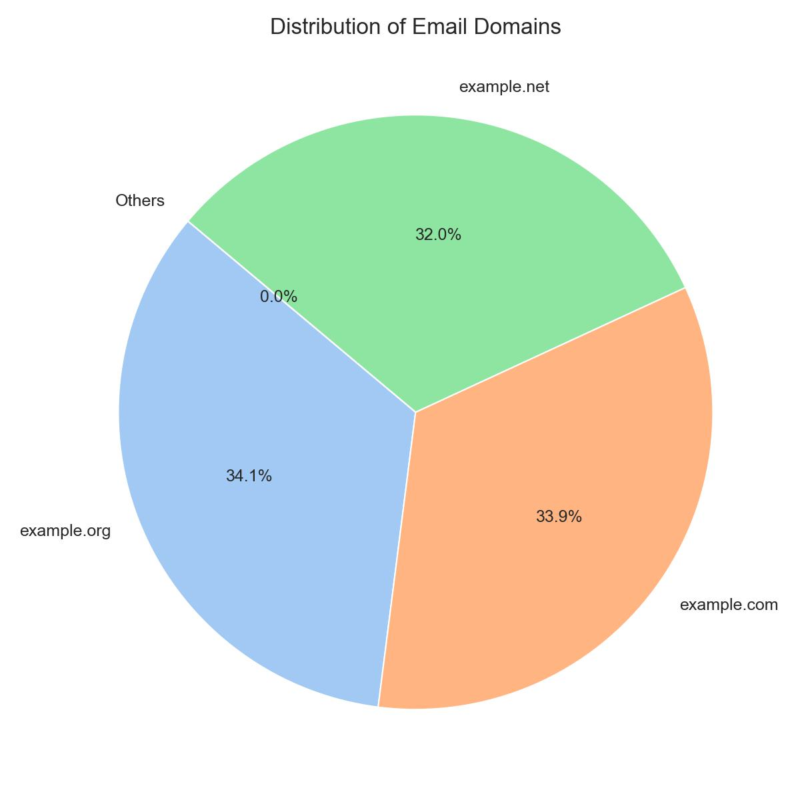
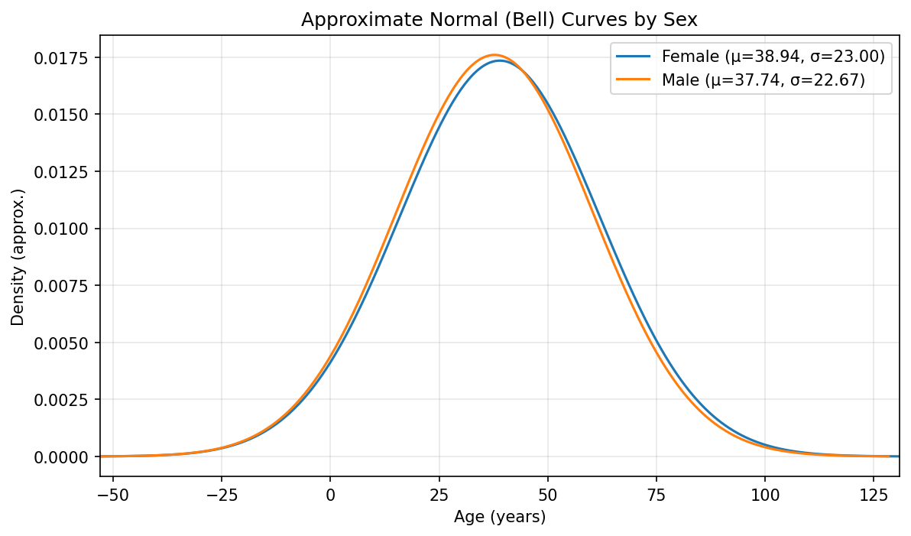
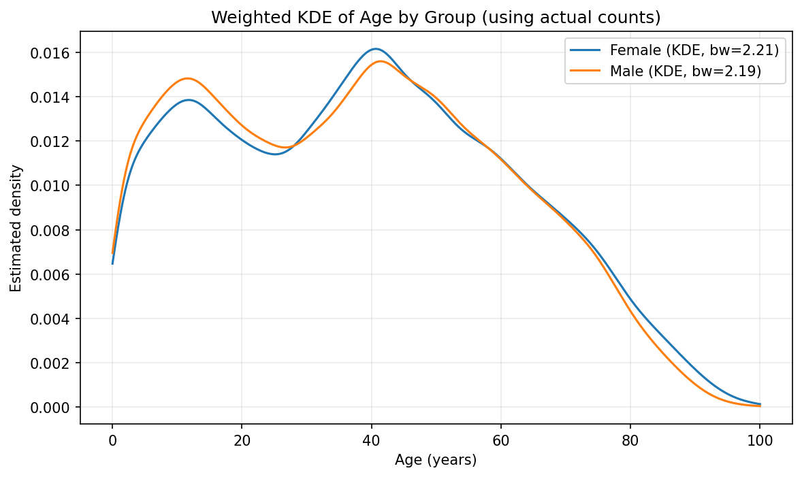
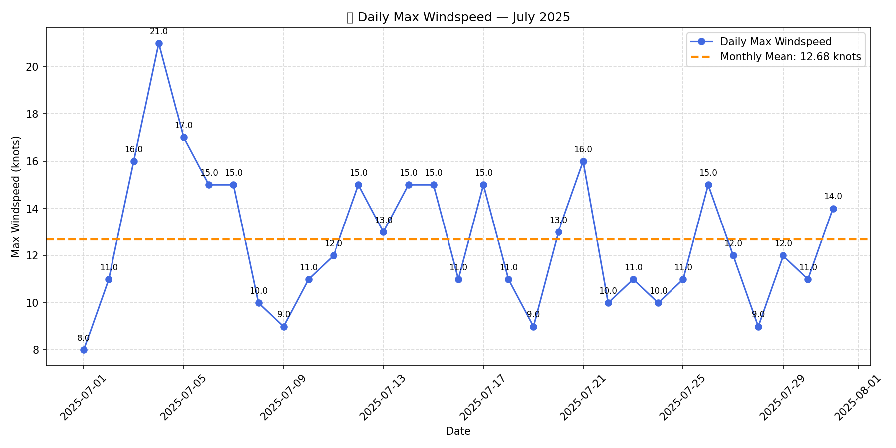

## 🧮 Programming For Data Analytics Module – 2025/2026

Welcome to Edward Cronin’s repository for the Programming For Data Analytics module. This repository contains submissions for assigned tasks, a comprehensive final project, and additional practice work completed during the academic year.

---

## 📁 Repository Structure

This repository is organised into three main sections:

- **Assignments 2025/2026**  
  Includes all formally assessed tasks from the module, demonstrating applied skills in data analysis, visualisation, and Python programming.

- **Final Project 2025/2026**  
  Integrates concepts from across the module into a single, cohesive analysis project.

- **MyWork 2025/2026**  
  Contains exploratory and practice notebooks not submitted for assessment, but useful for demonstrating progress and experimentation.

---

## 👤 Author

- **Name:** Edward Cronin  
- **Student ID:** g00425645  
- **Email:** g00425645@atu.ie

---

## 📥 How to Download This Repository

To download and run the code:

1. Visit [Edward Cronin’s Programming For Data Analytics repository](https://github.com/ECronin1973/programming-for-data-analytics)
2. Click the green **Code** button and select **Download ZIP**
3. Extract the ZIP file locally
4. Ensure Python is installed before running any scripts or notebooks

---

## 📜 Code of Conduct

A code of conduct is included in the repository to guide respectful collaboration and responsible use. Reviewers and contributors are encouraged to follow its principles.

---

## 🧠 Coding Guidelines and References

This repository follows established best practices for coding, documentation, and reproducibility in computational notebooks:

- **Jupyter Best Practices**  
  Narrative text explains the rationale behind each step, with references included where appropriate.  
  🔗 [Jupyter.org/practices](https://jupyter.org/practices)

- **The Turing Way**  
  Emphasises documenting *why* decisions were made, not just *what* was done.  
  🔗 [The Turing Way](https://the-turing-way.netlify.app/reproducible-research/overview/overview.html)

- **Diátaxis Documentation Framework**  
  Encourages separating conceptual documentation (why) from procedural steps (how), with background placed in README files.  
  🔗 [Diátaxis](https://diataxis.fr/)

- **PEP 8 – Python Style Guide**  
  Promotes clear, readable code and consistent commenting. Markdown cells in notebooks serve as the narrative layer.  
  🔗 [PEP 8](https://peps.python.org/pep-0008/)

---

## 🏛️ Assignment 02 – Bank Holidays

This repository contains two Python scripts that interact with the UK Government’s public API to retrieve and analyse bank holiday data, with a focus on Northern Ireland.

### 📍 Part A: Display All Bank Holidays

This task involves writing a Python script that connects to the UK Government’s bank holidays API and displays all holidays listed under Northern Ireland. Some of these dates may also be shared with other UK regions such as England, Wales, or Scotland.

### 🎯 Learning Objectives

- Interact with a RESTful API using Python and the requests library

- Parse JSON responses and extract structured data

- Filter and display region-specific information

- Format terminal output for clarity and readability

### 📁 Source File

This script is located in the root directory of the repository and is saved as:  
`assignment02-bankholidays.py`

### ▶️ Run the program from the root directory using Python:

```python
python assignment02-bankholidays.py
```

#### Sample Output

```plaintext
Bank Holidays in Northern Ireland:
2026-03-17 - St Patrick’s Day
2026-07-13 - Battle of the Boyne (Orangemen’s Day)
```

## 📍 Part B: Display Unique Bank Holidays in Northern Ireland

This task builds on Part A by enhancing the script to identify bank holidays that are exclusive to Northern Ireland — those not observed in England, Wales, or Scotland. It demonstrates how to compare datasets across regions and apply conditional logic to filter unique entries.

## 🎯 Learning Objectives

- Compare structured data across multiple regions

- Apply set logic to identify unique values

- Implement conditional filtering in Python

- Display filtered results clearly in the terminal

## 📁 Source File

This script is located in the root directory of the repository and is saved as:  
`assignment02-bankholidays-ni.py`

#### Run the program from the root directory using Python:

```python
python assignment02-bankholidays-ni.py

```

#### Sample Output

When the script is executed, it should print a list of unique bank holidays in Northern Ireland that are not observed in England/Wales or Scotland.

```plaintext
Unique Bank Holidays in Northern Ireland:
2024-03-18 - St. Patrick's Day
2024-07-12 - Battle of the Boyne (Orangemen's Day)
2025-03-17 - St. Patrick's Day
2025-07-14 - Battle of the Boyne (Orangemen's Day)
2026-03-17 - St. Patrick's Day
2026-07-13 - Battle of the Boyne (Orangemen's Day)
2027-03-17 - St. Patrick's Day
2027-07-12 - Battle of the Boyne (Orangemen's Day)
```

### 📚 Resources for Completion of Assignment 02

To successfully complete Assignment 02 (Parts A and B), I consulted a range of academic materials, technical documentation, and online tutorials. These resources supported my understanding of JSON data structures, API integration, and data comparison techniques across UK regions.

#### 🏫 Academic Materials from ATU

**Lecture: Representing Data**

I attended the lecture in [Module 4369 – Programming for Data Analytics](https://vlegalwaymayo.atu.ie/course/view.php?id=12815) which introduced the concept of structured data formats such as JSON and explained how APIs are used to deliver real-time data. This was foundational for both retrieving and comparing bank holiday data.

**Assignment Brief**

I followed the instructions provided in Assignment 2, which outlined the tasks of extracting bank holidays for Northern Ireland and identifying those not shared with other UK regions.

**Lab Exercise: Topic 01 – Representing Data**

I completed the lab activities in [Lab 02 Datarepresentation.pdf](https://vlegalwaymayo.atu.ie/pluginfile.php/1590492/mod_url/intro/Lab%2001%20Datarepresentation.pdf?time=1759329869806), which demonstrated how to fetch and process JSON data using Python. This was particularly helpful for implementing loops and filters in Part B.

#### 🌐 Online Tutorials and Best Practices

[W3Schools – Python JSON Guide](https://www.w3schools.com/python/python_json.asp)

I used W3Schools to learn how to convert JSON into Python dictionaries and iterate through data. This supported my implementation of loops and conditional logic.

[Real Python – API Integration Guide](https://realpython.com/python-requests/)

I read Real Python’s tutorial to understand best practices for working with APIs, including error handling, response validation, and clean output formatting. These techniques improved the robustness and readability of my scripts.

### 🧠 Summary of Learning Outcomes

Through completing Assignment 02, I developed a practical understanding of how to work with public APIs and structured data formats such as JSON. Specifically, I learned to:

- Use the requests library to retrieve live data from a RESTful API.

- Parse and navigate nested JSON structures to extract relevant information.

- Apply set logic and conditional filtering to compare datasets across multiple regions.

- Structure Python scripts with clear functions, error handling, and readable output.

- Follow best practices for code documentation, modular design, and terminal execution.

- Reference and build upon official documentation and academic resources to support development.

- Present technical work in a clear, well-organised format suitable for peer and expert review.

These skills contribute to a broader foundation in data analytics and software development, particularly in handling real-world data sources and producing maintainable, user-friendly code.


# END

---

## 🏛️ Assignment 03 – Email Domain Analysis (Pie Chart)

This repository contains a Jupyter notebook that analyses a dataset of 1,000 individuals to identify and visualise the distribution of email domains. The notebook extracts domain names from email addresses and presents the results in a pie chart using Python libraries.

### 📍 Task: Visualise Email Domains

This task involves writing a Python notebook that loads a CSV file, extracts the domain portion of each email address, counts how frequently each domain appears, and generates a pie chart to display the distribution. The chart includes all domain types found in the dataset, as only three unique domains are present.

### 🎯 Learning Objectives

- Load and inspect structured CSV data using pandas

- Extract domain names from email addresses using string operations and regular expressions

- Count domain frequencies and identify unique domain types

- Generate and style a pie chart using matplotlib and seaborn

- Save visual output for inclusion in reports or submissions


## 📁 Source Files

| File Path | Description |
|-----------|-------------|
| `assignments/assignment03-pie.ipynb` | Main notebook for Assignment 03. Loads the dataset, extracts email domains, counts them, and creates a pie chart. |
| `assignments/data/assignment03_people.csv` | Dataset of 1,000 individuals. The `Email` column is used to extract domain names. |

### ▶️ Run the notebook

▶️ Run the notebook from the root directory using Jupyter:
```bash
jupyter notebook assignments/assignment03-pie.ipynb
```

### Sample Output

When the notebook is executed, it will display a pie chart showing the percentage and count of each email domain found in the dataset. Since only three domain types exist, all are shown directly without grouping.

```plaintext
📌 Total unique email domain types: 3
📊 Domain frequency table:
example.org     400
example.net     350
example.com     250
```

### 📊 Pie Chart Output

The pie chart below visualises the distribution of all email domain types found in the dataset:



### 📚 Resources for Completion of Assignment 03

To successfully complete Assignment 03, I consulted a range of academic materials, technical documentation, and online tutorials. These resources supported my understanding of data extraction, string manipulation, and visualisation techniques.

#### 🏫 Academic Materials from ATU

**Lecture: Acquiring Data**

I viewed the lecture in [Module 4369 – Programming for Data Analytics](https://vlegalwaymayo.atu.ie/course/section.php?id=327540), which covered how to acquire and process datasets from various sources. This was foundational for downloading and preparing the CSV file used in this assignment.

**Assignment Brief**

I followed the instructions provided in [Assignment 3](https://vlegalwaymayo.atu.ie/mod/page/view.php?id=1204040), which outlined the task of extracting email domains and visualising them using a pie chart. The brief helped guide the structure and focus of the notebook.

#### 🌐 Online Tutorials and Best Practices

**pandas Documentation**

I used **pandas** to load the dataset, extract domain names, and count their frequency. The documentation helped clarify the use of [str.extract()](https://pandas.pydata.org/docs/reference/api/pandas.Series.str.extract.html#pandas.Series.str.extract) and [value_counts()](https://pandas.pydata.org/docs/reference/api/pandas.Series.value_counts.html).

**matplotlib Pie Chart Guide**

This [matplotlib guide](https://matplotlib.org/stable/gallery/pie_and_polar_charts/pie_features.html) supported the creation of a styled pie chart, including percentage labels, colour palettes, and layout adjustments.

**seaborn Documentation**

I used [**seaborn**](https://seaborn.pydata.org/) to apply a pastel colour palette for improved visual clarity and consistency. The [seaborn documentation](https://seaborn.pydata.org/tutorial/color_palettes.html) provided guidance on selecting and applying colour palettes to matplotlib plots.


END
---

# 📊 Assignment 05 – Population Analysis by Sex and Age

This assignment explores population data by sex and single year of age using official census statistics. It demonstrates how to clean, transform, and analyse demographic data using Python and pandas, with a strong emphasis on clarity, reproducibility, and educational structure.

---

## 🎯 Task A — Sex-Based Age Analysis (70%)

Write a Jupyter notebook that analyses the differences between the sexes by age in Ireland:

- Calculate the **weighted mean age** for each sex
- Measure the **difference between sexes** across single-year age groups

This part focuses solely on national-level data and does **not** require regional analysis.

---

## 📚 Learning Objectives

By completing this task, students will:

- Load and clean raw CSV data using pandas
- Pivot data to compare population counts by sex across age groups
- Compute weighted statistics: mean, median, and standard deviation
- Visualise distributions using parametric bell curves and kernel density estimation (KDE)
- Export tidy, analysis-ready tables for further use or review

---

## 🧰 Notebook Structure and Helper Functions

The notebook follows a modular design with reusable helper blocks defined at the top. These support clarity, maintainability, and pedagogical transparency. Each helper is documented inline and used throughout the analysis cells.

### 🔧 Key Helpers

- **Save and Display Plots**  
  Centralises logic for saving figures and displaying them inline.  
  Ensures consistent formatting and reproducibility.  
  → [`matplotlib.pyplot.savefig`](https://matplotlib.org/stable/api/_as_gen/matplotlib.pyplot.savefig.html)

- **I/O and Loader Helpers**  
  Handle robust file loading and saving using canonical paths (e.g. `DATA_DIR`).  
  Avoid hardcoded paths and support fallback to in-memory data.  
  → [`pathlib.Path`](https://docs.python.org/3/library/pathlib.html), [`pandas.read_csv`](https://pandas.pydata.org/docs/reference/api/pandas.read_csv.html)

- **Statistical Computation**  
  Perform reusable calculations such as weighted mean and standard deviation.  
  Keep analysis cells focused on interpretation.  
  → [`numpy.average`](https://numpy.org/doc/stable/reference/generated/numpy.average.html)

- **Plotting (Bell Curve and KDE)**  
  Generate consistent visualisations with clear styling.  
  → [`seaborn.kdeplot`](https://seaborn.pydata.org/generated/seaborn.kdeplot.html), [`matplotlib.pyplot.bar`](https://matplotlib.org/stable/api/_as_gen/matplotlib.pyplot.bar.html)

- **Top-N Age Display**  
  Show a compact preview of the top age rows for each sex.  
  → [`pandas.DataFrame.sort_values`](https://pandas.pydata.org/docs/reference/api/pandas.DataFrame.sort_values.html)

- **Tidy Age-Difference Loader**  
  Load cleaned age-by-sex data with normalised column types.  
  → [`pandas.Series.astype`](https://pandas.pydata.org/docs/reference/api/pandas.Series.astype.html)

- **Administrative County Builder**  
  Construct a tidy CSV showing population differences by age and sex, including county breakdowns.  
  → [`pandas.DataFrame.to_csv`](https://pandas.pydata.org/docs/reference/api/pandas.DataFrame.to_csv.html)

---

### 🧠 Why This Structure?

Separating helper functions from analysis cells makes the notebook:

- Easier to maintain and extend
- More readable for students and reviewers
- Reusable across multiple assignments or datasets

Each analysis cell calls these helpers to perform specific tasks (e.g. comparing sexes in an age band, plotting distributions, identifying regional differences), keeping the workflow modular and pedagogically clear.

---

## 📁 Source File

This notebook is located at:  
[`assignment05-population.ipynb`](https://github.com/ECronin1973/programming-for-data-analytics/blob/main/assignment05-population.ipynb)

---

## How to run the notebook

1. Ensure you have Python 3.x installed with the required libraries: `pandas`, `numpy`, `matplotlib`, and `seaborn`.
2. Download the repository and navigate to the root directory.
3. Run the notebook using Jupyter:
```bash
jupyter notebook assignment05-population.ipynb
```

---
## 🧹 Data Cleaning Steps

The raw dataset is cleaned by:

- Dropping metadata columns not required for analysis
- Filtering to retain only 'Male' and 'Female' rows
- Standardising age labels (e.g. converting 'Under 1 year' to `0`)
- Removing non-numeric age entries and converting types
- Ensuring all population counts are stored as integers

---

## 📈 Pivot Table Creation

A pivot table is constructed with:

- **Rows**: Single year of age  
- **Columns**: Sex ('Male', 'Female')  
- **Values**: Population counts

This structure enables direct comparison of male and female population counts across age groups.

---

## 🧮 Statistical Analysis

The notebook computes the following per sex:

- **Weighted Mean Age** — average age weighted by population count  
- **Weighted Standard Deviation** — spread of ages around the weighted mean  
- **Weighted Median Age** — age at which half the population is younger and half is older

Each statistic is saved to CSV for reproducibility and downstream use.

---

## 🔍 KDE and Bell Curve Visualisation

Two visualisations are provided:

- **Parametric Bell Curve** — approximates a normal distribution using weighted mean and standard deviation  
- **Kernel Density Estimate (KDE)** — smoothed density based on actual age counts, without assuming normality

Plots are saved as PNG files and designed for clarity and accessibility.

### 📸 Visual Outputs

These are the two main plot outputs produced by the notebook (saved to the root `plots/` folder):


  
_Parametric bell curves generated using the weighted mean (μ) and weighted standard deviation (σ) for each sex. Useful for a concise, parametric comparison but assumes normality._

  
_Weighted KDE computed from the single-year age counts; this non-parametric curve reveals the actual shape of the distribution (skew, modes, tails) that a simple bell curve may miss._

**Interpretation**: Use the KDE as the primary visual check for the real distribution shape. Use the bell-curve as a compact parametric summary. If the KDE shows strong skew or multiple peaks, prefer the KDE for interpretation and reporting.

---

## 📊 Age Difference Analysis

The notebook also computes:

- Absolute difference in population count between sexes at each age  
- Which sex has a greater count at each age ('Male', 'Female', or 'Equal')

This is exported to `assignment05_age_difference_by_sex.csv` and supports further visualisation or reporting.

---

## 📦 Output Files

| Filename                                      | Description                                      |
|----------------------------------------------|--------------------------------------------------|
| `assignment05_weighted_stats_by_sex.csv`     | Pivot table of population counts by age and sex |
| `assignment05_weighted_mean_std_by_sex.csv`  | Weighted mean and standard deviation by sex     |
| `assignment05_weighted_median_by_sex.csv`    | Weighted median age by sex                      |
| `assignment05-age-bell-curve.png`            | Bell curve visualisation                        |
| `assignment05-age-kde.png`                   | KDE visualisation                               |
| `assignment05_age_difference_by_sex.csv`     | Age-wise population difference by sex           |
| `assignment05-age-mean-difference-bar.png`   | Bar chart of weighted mean age by sex           |

---

---

## 📚 Dependencies

This notebook requires the following Python libraries:

- `pandas` — for data manipulation  
- `numpy` — for numerical operations  
- `matplotlib` — for plotting  
- `seaborn` — for KDE visualisation  
- Python 3.x environment

---

## 🧠 Pedagogical Design

The notebook is designed to be:

- **User-friendly** — clear comments, modular structure, and reproducible outputs  
- **Reviewer-friendly** — explicit validation steps, consistent formatting, and saved artefacts  
- **Future-proof** — reusable code blocks adaptable to other datasets or assignments

---

## 🧮 Assignment 05 – Part B: Age-Band Sex Comparison (20%)

This section compares the population of males and females within a selected age band (e.g. ages 30–40) and produces both a visual and tabular summary.

### ⚙️ What This Cell Does

- Loads a tidy age-by-sex table from memory or from `assignment05_age_difference_by_sex.csv`
- Filters rows where `age` is within `[target_age − 5, target_age + 5]`
- Aggregates total counts for each sex and calculates:
  - Total population
  - Difference (Male − Female)
  - Percentage difference of band total
- Saves a bar chart to `assignment05-age-group-35-sex-comparison.png`
- Displays a table with per-age breakdown and majority sex
- Prints a concise summary of the result

### ▶️ How to Run

1. Restart the notebook kernel and run all cells from the top to ensure helper functions and data loading steps are executed.
2. Run the Part B cell to perform the age-band comparison.  
   You can change `target_age = 35` to inspect other age bands.
3. Run the Part C cell to perform the regional analysis.  
   Ensure the dataset `assignment05_age_difference_by_sex_with_region.csv` has been created or loaded.


### 📊 Output Table — Ages 30–40

| Age | Female | Male | Difference | Majority |
|-----|--------|------|------------|----------|
| 30  | 2,052  | 1,928 | -124       | Female   |
| 31  | 2,106  | 2,014 | -92        | Female   |
| 32  | 2,148  | 2,025 | -123       | Female   |
| 33  | 2,155  | 1,993 | -162       | Female   |
| 34  | 2,267  | 2,070 | -197       | Female   |
| 35  | 2,371  | 2,168 | -203       | Female   |
| 36  | 2,439  | 2,239 | -200       | Female   |
| 37  | 2,449  | 2,276 | -173       | Female   |
| 38  | 2,556  | 2,344 | -212       | Female   |
| 39  | 2,662  | 2,421 | -241       | Female   |
| 40  | 2,696  | 2,518 | -178       | Female   |

### 🧠 Interpretation

In the age band 30–40, females outnumber males by **1,905 people**, which is approximately **3.82%** of the total population in that band.

### 📂 Files Produced

- [Age Group Comparison](assignments/plots/assignment05-age-group-35-sex-comparison.png) - bar chart

- `assignment05_age_difference_by_sex.csv` — tidy age-by-sex table

---

## 🧮 Assignment 05 – Part C: Regional Sex Difference Analysis (10%)

This section identifies which **Administrative County** in Ireland has the **largest population difference between sexes** within the selected age band.

### ⚙️ What This Cell Does

1. Loads `assignment05_age_difference_by_sex_with_region.csv`  
2. Filters to the selected age band (e.g. ages 30–40)  
3. Excludes the national total ("Ireland")  
4. Aggregates male and female counts by county  
5. Calculates signed and absolute differences  
6. Identifies the county with the largest gap  
7. Visualises the top 10 counties using a colour-coded bar chart  
8. Prints a summary of the result

### 📊 Output Table — Top 10 Counties (Female Majority)

| Administrative County                     | Male   | Female | Difference (M−F) | Majority |
|-------------------------------------------|--------|--------|------------------|----------|
| Fingal County Council                     | 26,150 | 29,092 | -2,942           | Female   |
| Cork County Council                       | 23,706 | 26,545 | -2,839           | Female   |
| South Dublin County Council               | 23,637 | 26,361 | -2,724           | Female   |
| Kildare County Council                    | 18,671 | 20,602 | -1,931           | Female   |
| Meath County Council                      | 15,981 | 17,715 | -1,734           | Female   |
| Wicklow County Council                    | 10,338 | 11,943 | -1,605           | Female   |
| Galway County Council                     | 12,421 | 13,904 | -1,483           | Female   |
| Dún Laoghaire Rathdown County Council     | 17,074 | 18,450 | -1,376           | Female   |
| Wexford County Council                    | 10,824 | 12,162 | -1,338           | Female   |
| Kerry County Council                      | 9,957  | 11,125 | -1,168           | Female   |

### 🧠 Interpretation

📍 **County with largest difference**: Fingal County Council  
🧮 Male = 26,150, Female = 29,092, Diff (M−F) = −2,942, % of band = **5.33%**  
🧠 Fingal has the largest gap because it has **2,942 more females than males** in the selected age band.

🎨 **Legend**  
- 🔵 Blue = Male majority  
- 🌸 Pink = Female majority  
Each bar represents the absolute population difference in the selected age band.  
📍 Age Band: Ages 30–40 (Centre = 35)

### 📂 Files Produced

- [assignment05-age-group-35-region-sex-diff.png](assignments/plots/assignment05-age-group-35-region-sex-diff.png) — bar chart

---

## 🧠 Personal Reflection

This assignment was the most challenging so far, requiring me to revisit lectures, adapt course notebooks, and consult documentation to implement weighted statistics and KDE visualisations. I reviewed materials from previous modules to reinforce key concepts and applied a modular workflow: select → aggregate → visualise → interpret. Part C involved integrating regional data, which I addressed by generating a new dataset with county-level breakdowns. I also revised and simplified all code cells to improve clarity and make the notebook easier to understand.

---

## 🙏 Acknowledgements

This work was partially supported by **GitHub Copilot**, an AI-powered code completion tool developed by GitHub, which assisted in generating parts of the code.

---

## 📚 References and Learning Resources

The following resources were consulted and integrated throughout the notebook to support implementation, conceptual understanding, and reviewer transparency:

### 🎓 ATU Learning Materials

- **Lecture: Analysis and Some Stats**  
  [Programming For Data Analytics](https://vlegalwaymayo.atu.ie/course/view.php?id=12815)  
  Provided foundational guidance on statistical analysis and visualisation techniques.

- **Assignment 05 Brief**  
  [Assignment Instructions](https://vlegalwaymayo.atu.ie/mod/page/view.php?id=1362128)  
  Defined the three-part structure and shaped the notebook’s modular design.

---

### 🐍 Python Libraries and Documentation

- [`pandas`](https://pandas.pydata.org/) — data cleaning, pivoting, and exporting  
- [`NumPy`](https://numpy.org/) — weighted statistics and numeric operations  
- [`SciPy`](https://docs.scipy.org/doc/scipy/reference/generated/scipy.stats.gaussian_kde.html) — KDE implementation  
- [`seaborn`](https://seaborn.pydata.org/generated/seaborn.kdeplot.html) — KDE plotting  
- [`matplotlib`](https://matplotlib.org/stable/contents.html) — bar charts and legends

---

### 📊 Statistical Concepts and Visualisation

- [Kernel Density Estimation (Wikipedia)](https://en.wikipedia.org/wiki/Kernel_density_estimation)  
- [Normal Distribution (Wikipedia)](https://en.wikipedia.org/wiki/Normal_distribution)  
- [Weighted Mean & Variance (Wikipedia)](https://en.wikipedia.org/wiki/Weighted_arithmetic_mean)  
- [Weighted Median (Real Statistics)](https://real-statistics.com/descriptive-statistics/measures-central-tendency/weighted-mean-and-median/)

---

### 📈 Data Source and Teaching Aids

- [CSO FY006A – Population Dataset](https://ws.cso.ie/public/api.restful/PxStat.Data.Cube_API.ReadDataset/FY006A/CSV/1.0/en)  
- [XKCD #221 – Normal Distribution Comic](https://xkcd.com/221/)  
- [GitHub Copilot](https://github.com/features/copilot) — used during development

# END

---

## 🛰️ Assignment 06 — Knock Airport Weather

(assignment_6_Weather.ipynb)

This Jupyter notebook analyses hourly weather observations from Knock Airport (Met Éireann station) and generates daily and monthly temperature summaries. The workflow is designed to be reproducible: the raw CSV is downloaded once, saved locally, and then parsed and aggregated to produce cleaned datasets and visual outputs.

### 🎯 Learning Objectives

By completing this assignment, students will:
- Download and store raw hourly weather data from Met Éireann.
- Parse and clean real-world meteorological data.
- Plot hourly temperature data for a selected day.
- Compute and save daily mean temperatures for a custom date range.
- Compute and save monthly mean temperatures for seasonal analysis.

### 📂 Data Source

Met Éireann hourly weather data (Knock Airport): https://cli.fusio.net/cli/climate_data/webdata/hly4935.csv

### 📁 Files Generated by the Notebook

**Notebook:**
- `assignments/notebooks/assignment_6_Weather.ipynb`

**Data (saved by the notebook):**
- `assignments/data/climate_data.csv` — raw downloaded data  
- `assignments/data/climate_data_mean_daily_custom_range.csv` — daily means for a selected date range  
- `assignments/data/climate_data_mean_daily_summer_2025.csv` — daily means for Summer 2025  
- `assignments/data/monthly_mean_by_season_2025.csv` — monthly means by season

**Plots:**
- `assignments/plots/mean_daily_custom_range.png`  
- `assignments/plots/mean_daily_summer_2025.png`  
- `assignments/plots/monthly_mean_by_season_2025.png`

## 🧠 Methodology Overview

- **Download:** The notebook fetches the CSV from Met Éireann and saves it to `assignments/data/` to ensure reproducibility.
- **Parsing:** Metadata rows are skipped, and the date/time column is parsed using multiple format checks with fallback to pandas’ default parser.
- **Cleaning:** Temperature values are coerced to numeric. Non-numeric entries are converted to NaN and excluded from aggregation.
- **Aggregation:**
  - **Daily means:** Grouped by date, calculating mean, count, and standard deviation. Results are saved and visualised.
  - **Monthly means:** Grouped by month within seasonal windows. Results are saved and plotted by season.
- **Interactivity:** An interactive widget allows users to explore hourly temperatures for a selected date (requires Jupyter with `ipywidgets`).

## 📈 Student Approach: Plotting Hourly Temperatures

I began by inspecting the raw CSV to understand its structure and identify the relevant columns for temperature analysis. The file contained metadata rows, which I excluded using a robust CSV loading function. I implemented flexible date parsing to accommodate various formats and ensured that temperature values were converted to numeric, handling any invalid entries appropriately.

After downloading the data from Met Éireann and saving it as `climate_data.csv`, I noted that the dataset extended only up to 1st October 2025. I defined seasonal boundaries to enable focused analysis of specific periods, such as Summer 2025.

I selected the period from 10th to 16th July 2025 for detailed analysis, as this week was identified as a significant heat event. According to [BreakingNews.ie](https://www.breakingnews.ie/ireland/july-2025-was-9th-hottest-on-record-with-highest-temperature-of-31-degrees-1789636.html), Knock Airport recorded its highest July temperature on record during this time (28.7°C).

### 📊 Outputs: Hourly Temperatures


This table displays hourly temperatures for the selected date range, colour-coded using a seaborn-style heatmap to highlight temperature variation across each day.

An interactive widget is included in the notebook to allow users to select a specific date and view its hourly temperature profile. This widget is not visible in GitHub’s static rendering but works in Jupyter with `ipywidgets` installed.


A static plot is also generated for the selected date (10th July 2025):


## 📈 Student Approach: Plotting Daily Mean Temperatures

Next, I computed daily mean temperatures for the selected range (10th–16th July 2025) using the cleaned dataset. I grouped the data by date, calculated the mean temperature, and saved the results to `climate_data_mean_daily_summer.csv`. I then created a time series plot of the daily means, saved as `mean_daily_custom_range.png`.

### 📊 Output


## 📈 Student Approach: Plotting Monthly Mean Temperatures

Finally, I calculated monthly mean temperatures for Winter (Dec 2024–Feb 2025), Spring (Mar–May 2025), and Summer (Jun–Aug 2025). I excluded Winter 2025 as it had not yet occurred. The data was grouped by month, and the results were saved to `monthly_mean_by_season_2025.csv`. A seasonal line plot was also generated.

### 📊 Output


## 📌 Summary of Findings

- Daily mean temperatures reflect the expected seasonal cycle, with higher values in summer and lower in winter.
- Monthly summaries provide a clear overview of seasonal trends and can be used for further comparative analysis.

## ▶️ How to Run the Notebook

1. Open `assignments/notebooks/assignment_6_Weather.ipynb` in Jupyter or JupyterLab.  
2. Run all cells from top to bottom. The notebook will:
   - Download the raw CSV to `assignments/data/climate_data.csv`
   - Generate cleaned CSV summaries
   - Save plots to `assignments/plots/`
3. To use the interactive widget for hourly temperatures, ensure `ipywidgets` is installed in your Jupyter environment (e.g. `%pip install ipywidgets`).

## 🛠️ Notes & Troubleshooting

- If you encounter an `AttributeError` related to `Jinja2` when using `pandas.DataFrame.style`, install it with `%pip install jinja2`, or rely on the fallback plain table rendering.
- If header detection fails, open `assignments/data/climate_data.csv` and share the first ~30 lines so the parsing logic can be adjusted.

## 📚 References

- Met Éireann hourly data: [Knock Airport CSV](https://cli.fusio.net/cli/climate_data/webdata/hly4935.csv)  
- [pandas documentation](https://pandas.pydata.org/)  
- [matplotlib documentation](https://matplotlib.org/)  
- [seaborn documentation](https://seaborn.pydata.org/)  
- [ipywidgets documentation](https://ipywidgets.readthedocs.io/)


## Windspeed analysis at Knock Airport (Summer 2025)

### Overview

This section prepares and analyses mean wind speed (column `wdsp`, units: knots) from Knock Airport, focusing on Summer 2025 and the period 10–16 July 2025. The workflow covers:

- downloading and saving the raw CSV for reproducibility;
- parsing and cleaning the dataset;
- diagnosing and handling missing values; and
- filtering and visualising hourly and daily windspeed patterns.

The aim is to describe wind behaviour during the heatwave week and to provide reproducible, well‑documented outputs for reporting.

## 🌬️ Step 1 — preparing windspeed data

This step loads the saved Knock Airport CSV and prepares it for analysis:

- Datetime parsing: the code attempts to detect a consistent datetime format from sample values and falls back to robust pandas parsing if required.
- Windspeed cleaning: the `wdsp` column (mean wind speed, knots) is coerced to numeric with `pd.to_numeric(..., errors='coerce')`; invalid tokens become `NaN`.
- Missing‑value handling: invalid or missing `wdsp` values are documented and excluded from summary statistics by default. See the missing‑data policy below.
- Cleaned data is saved for reproducibility to: `assignments/data/windspeed_cleaned_summer_2025.csv`


### 🧼 Missing Data Strategy
This project follows a conservative and traceable approach to handling missing values in weather datasets, specifically windspeed data from Knock Airport.

Steps:

- Coerce to numeric: Convert wdsp to numeric using errors='coerce' to expose invalid entries as NaN.

- Validate datetime: Detect and apply consistent datetime formats for reliable filtering and grouping.

- Filter by season: Subset the data to Summer 2025 using predefined seasonal boundaries.

- Drop missing values: Remove rows with missing windspeed values before analysis.

- Save cleaned data: Export the cleaned dataset for reproducibility and downstream use.

#### References:

[Forecasting: Principles and Practice – Missing Values](https://otexts.com/fpp2/missing-outliers.html)

[pandas.to_numeric](https://pandas.pydata.org/docs/reference/api/pandas.to_numeric.html)

[Dataquest: Data Cleaning Best Practices](https://www.dataquest.io/tutorial/data-cleaning-project-walk-through/)


## 🌬️ Step 2 — windspeed analysis (10–16 July 2025)

For the focus week (10–16 July 2025) the notebook:

#### filters the cleaned dataset using `custom_start` / `custom_end`
- **Purpose:** Focuses analysis on a specific time window (10–16 July 2025), enabling targeted investigation of wind behaviour during a known heatwave.

Reference:

- [pandas.DataFrame filtering — Boolean indexing](https://pandas.pydata.org/docs/user_guide/indexing.html#boolean-indexing) is the standard method for subsetting time series data in pandas.

#### groups observations by hour and date and creates a pivot table for side‑by‑side daily comparison
- **Purpose:** Restructures the data to compare hourly windspeed patterns across multiple days.

Reference:

- [pandas.pivot_table](https://pandas.pydata.org/docs/reference/api/pandas.pivot_table.html) — Recommended for multi-dimensional aggregation and reshaping.
- [Dataquest: Time Series Analysis with Pandas](https://www.dataquest.io/blog/tutorial-time-series-analysis-with-pandas/) — Demonstrates grouping by time components for comparative analysis.

#### computes daily summaries (count of valid hourly observations, mean, std, min, max) and flags days with insufficient observations
- **Purpose:** Ensures statistical summaries are based on sufficient data and flags incomplete days for transparency.

Reference:

- Hyndman & Athanasopoulos (2018): “It is usually best to remove missing values before computing summary statistics, unless you have a principled method for imputation.” [Forecasting: Principles and Practice – Missing Values](https://otexts.com/fpp2/missing-outliers.html)
- [pandas.DataFrame.agg](https://pandas.pydata.org/docs/reference/api/pandas.DataFrame.agg.html) — Used to compute count, mean, std, min, max across grouped data.

#### plots hourly and daily trends to highlight patterns and anomalies
**Purpose:** Visualises diurnal wind patterns and helps detect anomalies or correlations with temperature.

Reference:
- [matplotlib.pyplot](https://matplotlib.org/stable/users/index.html) — Industry-standard for time series plotting.
- [Seaborn and matplotlib for time series](https://seaborn.pydata.org/examples/timeseries_facets.html) — Shows best practices for visualising temporal patterns.
- [Data Cleaning Best Practices – Dataquest](https://www.dataquest.io/tutorial/data-cleaning-project-walk-through/) — Emphasises the importance of visual validation after cleaning.

#### Generated plots (example):


---

## 🌬️ Step 3: Rolling Windspeed Analysis — Single-Day Summary

This analysis focuses on hourly windspeed patterns for a specific date during Summer 2025, using cleaned observational data. The code loads the dataset `windspeed_cleaned_summer_2025.csv`, which contains timestamped windspeed readings from Knock Airport. After parsing the `datetime` column, the data is filtered to include only the 24-hour period defined by `custom_start` and `custom_end`.  The date selected for this analysis is 15th July 2025, a day within the heatwave week, this can be modified to view other dates.

Hourly windspeed values are grouped and reshaped into a pivot table, allowing side-by-side comparison across hours of the selected day. This table is saved as a CSV file for further analysis. A line plot is also generated to visualise windspeed fluctuations throughout the day, highlighting gusts, lulls, and diurnal trends.

### 📁 Outputs:
- **CSV file**: `windspeed_hourly_table_<date>_to_<date>.csv` *hourly_table_2025-07-15_to_2025-07-15.csv* — hourly windspeed values
- **Plot**: `windspeed_hourly_<date>_to_<date>.png` *windspeed_hourly_2025-07-15.png* — visual trend of windspeed over 24 hours


## 🌬️ Step 4: Daily Max Windspeed Analysis — 10–16 July 2025

This section calculates the highest windspeed recorded each day during the focus week (10–16 July 2025), using cleaned observational data from Knock Airport. The dataset `windspeed_cleaned_summer_2025.csv` is filtered to isolate the target date range. For each day, the code identifies the maximum windspeed and extracts the exact time it occurred.

This analysis helps pinpoint peak wind events and their timing, which is useful for understanding gust patterns, validating sensor performance, and correlating with other weather phenomena.

### 📁 Outputs:
- **CSV file**: `daily_max_windspeed_with_time_10_16_July_2025.csv` — includes `date`, `max_windspeed`, and `time_of_max`
- **Notebook table**: printed summary of daily peak windspeed events
- **Plot**: `daily_max_windspeed_line_10_16_July_2025.png` — line plot of daily maximum windspeed


## 📊 Monthly Mean of Daily Max Windspeeds — July 2025

This step calculates the average of daily peak windspeed values for the month of **July 2025**, using cleaned hourly data from Knock Airport. The dataset `windspeed_cleaned_summer_2025.csv` is filtered to include only July observations. For each day, the highest windspeed is extracted, and the mean of these daily maxima is computed to summarize wind intensity across the month.

This metric provides insight into the overall wind conditions during July and supports comparisons with other months or seasonal patterns.

### 📁 Outputs:
- **CSV file**: `daily_max_windspeed_July_2025.csv` — daily peak windspeed values
- **CSV file**: `monthly_mean_of_daily_max_windspeed_July_2025.csv` — single-row summary with monthly mean
- **Plot**: `monthly_mean_of_daily_max_windspeed_July_2025.png` — bar chart of daily max windspeed values

**Output Summary:**
- ✅ Saved daily max windspeed: ..\data\daily_max_windspeed_July_2025.csv
- ✅ Saved monthly mean of daily max windspeed: ..\data\monthly_mean_of_daily_max_windspeed_July_2025.csv
- 📈 Monthly Mean of Daily Max Windspeed (July 2025): 12.68 knots



END