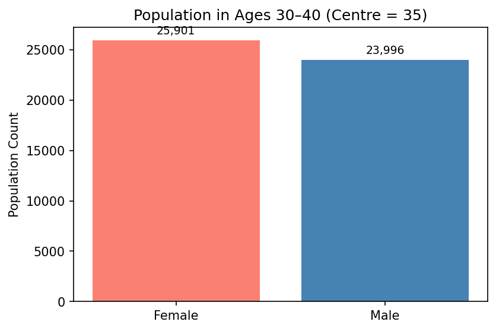
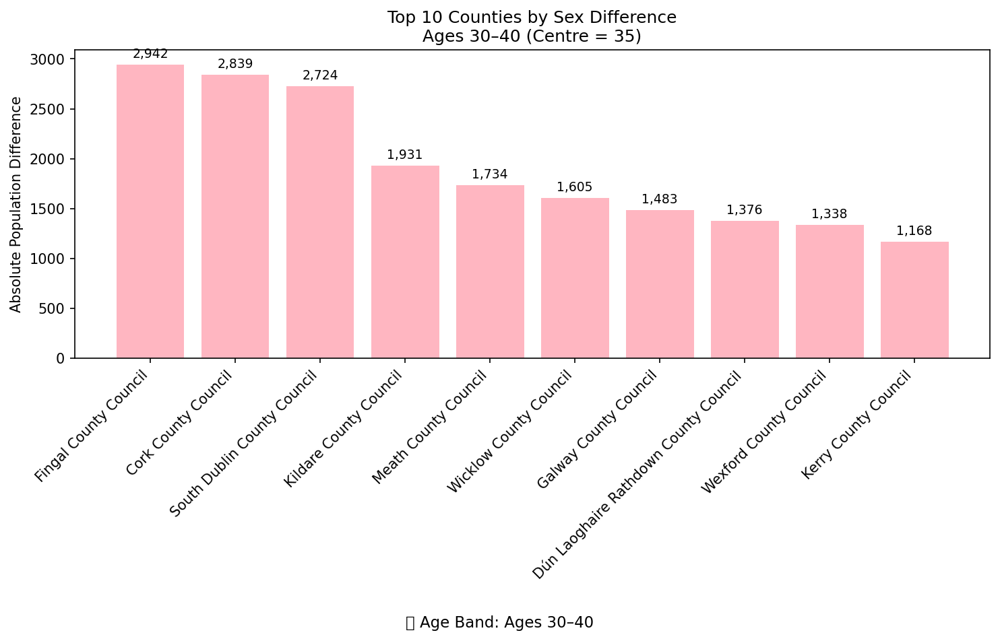
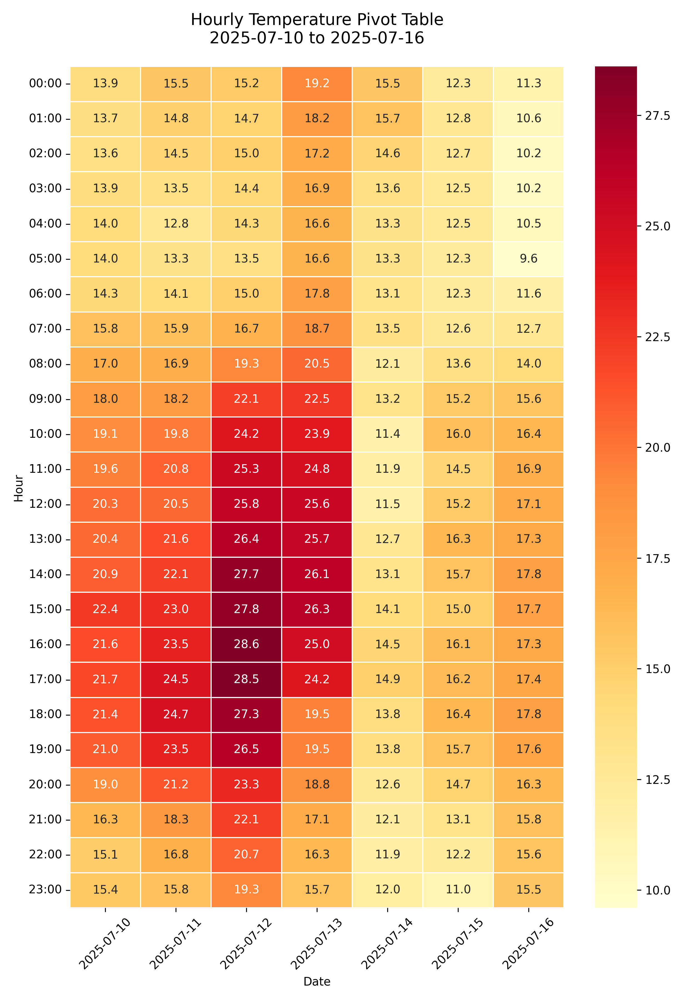
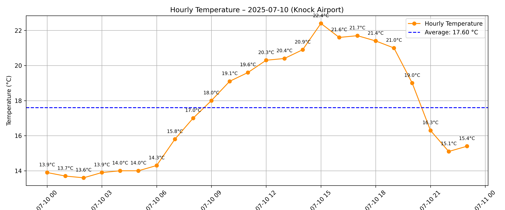
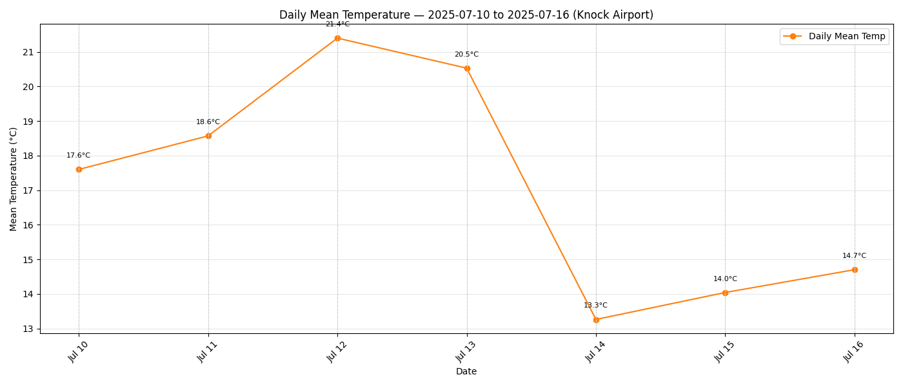
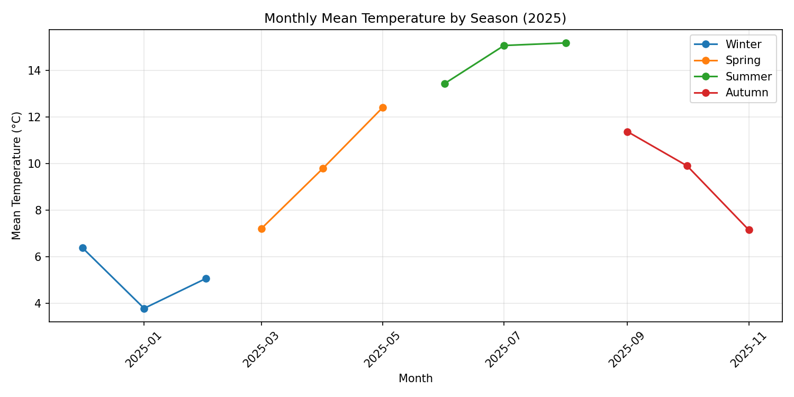
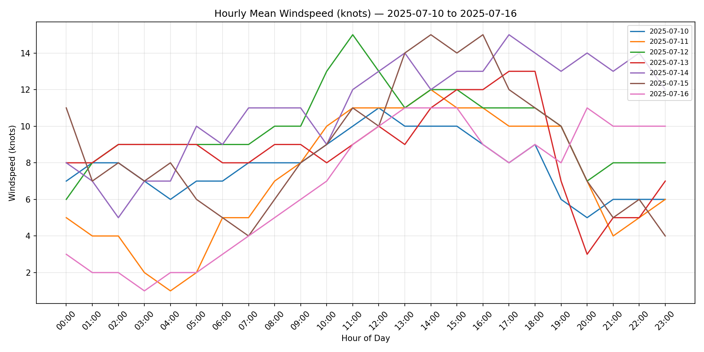
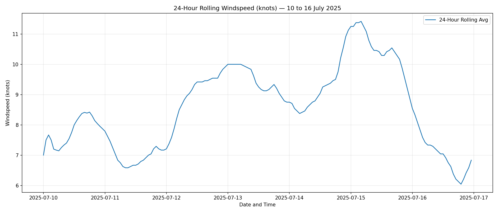
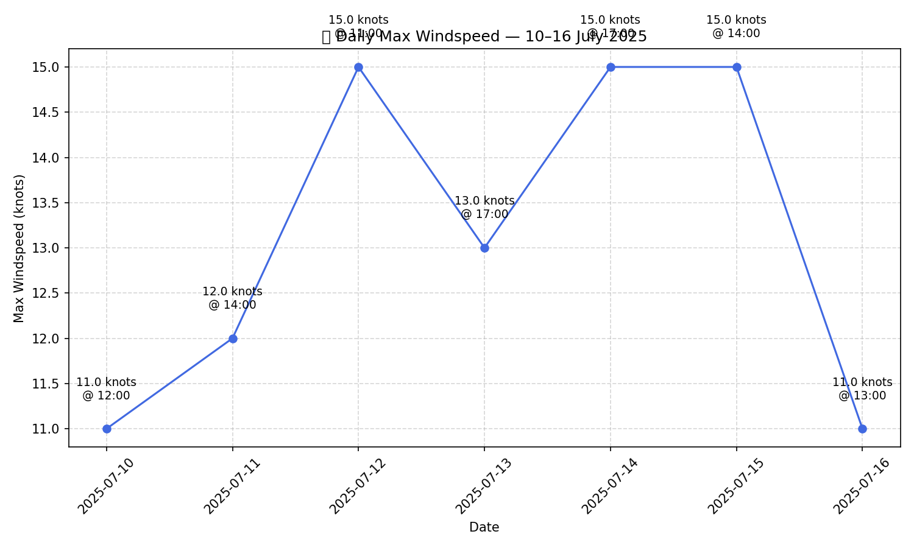
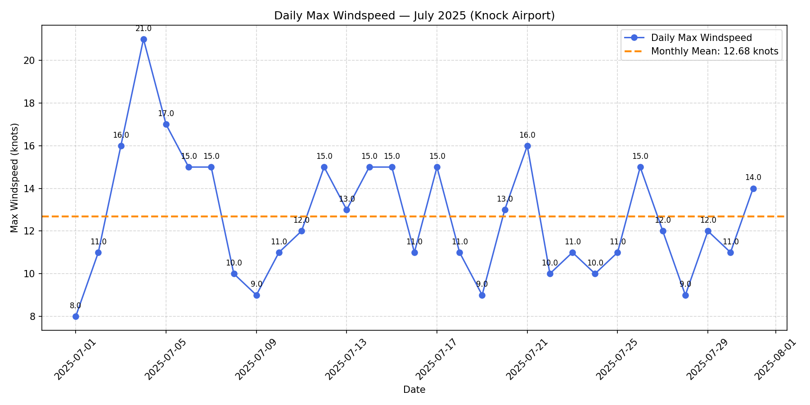

# 📑 Assignments – Programming For Data Analytics 2025/2026

This folder contains all formally assessed tasks for the **Programming For Data Analytics** module.  
Each assignment demonstrates applied skills in Python programming, data analysis, visualisation, and workflow organisation, completed during the 2025/2026 academic year.

---

## 📂 Contents
- Individual assignment notebooks and scripts, each with clear documentation and outputs.
- Supporting datasets used for analysis.
- Sub‑README files or notes where required to explain methodology and results.

---

## 🎯 Purpose
The assignments showcase:
- Practical application of module concepts.
- Use of Python libraries for data handling, visualisation, and statistical analysis.
- Reviewer‑friendly documentation and repository organisation.

---

## 👤 Author
- **Name:** Edward Cronin  
- **Student ID:** g00425645  
- **Email:** g00425645@atu.ie

---

## ▶️ How to Run

1. Clone the repository and navigate to the `Assignments` folder:
   ```bash
   git clone https://github.com/EdwardCronin1973/programming-for-data-analytics.git
   cd programming-for-data-analytics/Assignments
    ```

2. Install required packages (see requirements.txt in the root):
```bash
pip install -r ../requirements.txt
```

3. Open the assignment notebooks in Jupyter or VS Code:
```bash
jupyter notebook
```
Then select the relevant .ipynb file.

4. Run all cells in order to reproduce the analysis and outputs

5. Run Scripts directly from the command line where applicable:
```bash
python <input script file name>
```

6. all output files (plots, CSVs) will be automatically saved in the `plots/` or `data/` subfolders as specified in each assignment.

---

## Table of Contents
- [Assignment 02 – Bank Holidays](#️-assignment-02--bank-holidays)
    [Part A: Display All Bank Holidays](#-part-a-display-all-bank-holidays)
    [Part B: Display Unique Bank Holidays in Northern Ireland](#-part-b-display-unique-bank-holidays-in-northern-ireland)
- [Assignment 03 – Email Domain Analysis (Pie Chart)](#️-assignment-03--email-domain-analysis-pie-chart)
    [Pie Chart of Email Domains](#-pie-chart-output)
- [Assignment 05 – Population Analysis](#-assignment-05--population-analysis-by-sex-and-age)
    [Task A — Sex-Based Age Analysis (70%)](#task-a--sex-based-age-analysis-70)
    [Task B - Age-Band Sex Comparison (20%)](#task-b----age-band-sex-comparison-20)
    [Task C - Regional Sex Difference Analysis (10%)](#task-c---regional-sex-difference-analysis-10)
- [Assignment 06: Climate Data Analysis – Summer 2025, Knock Airport](#-assignment-06-climate-data-analysis--summer-2025-knock-airport)
    [Temperature Analysis (60% of marks)](#temperature-analysis-60-of-marks)
    [Windspeed Analysis (40% of marks)](#windspeed-analysis-40-of-marks)

---

## 🏛️ Assignment 02 – Bank Holidays

This repository contains two Python scripts that interact with the UK Government’s public API to retrieve and analyse bank holiday data, with a focus on Northern Ireland.

### 📍 Part A: Display All Bank Holidays

This task involves writing a Python script that connects to the UK Government’s bank holidays API and displays all holidays listed under Northern Ireland. Some of these dates may also be shared with other UK regions such as England, Wales, or Scotland.

### 🎯 Learning Objectives

- Interact with a RESTful API using Python and the requests library

- Parse JSON responses and extract structured data

- Filter and display region-specific information

- Format terminal output for clarity and readability

### 📁 Source File

This script is located in the root directory of the repository and is saved as:  
`assignment02-bankholidays.py`

### ▶️ Run the program from the root directory using Python:

```python
python assignment02-bankholidays.py
```

#### Sample Output

```plaintext
Bank Holidays in Northern Ireland:
2025-12-25 - Christmas Day
2025-12-26 - Boxing Day
2026-01-01 - New Year’s Day
2026-03-17 - St Patrick’s Day
2026-04-03 - Good Friday
2026-04-06 - Easter Monday
2026-05-04 - Early May bank holiday
2026-05-25 - Spring bank holiday
2026-07-13 - Battle of the Boyne (Orangemen’s Day)
2026-08-31 - Summer bank holiday
2026-12-25 - Christmas Day
2026-12-28 - Boxing Day
2027-01-01 - New Year’s Day
2027-03-17 - St Patrick’s Day
2027-03-26 - Good Friday
2027-03-29 - Easter Monday
2027-05-03 - Early May bank holiday
2027-05-31 - Spring bank holiday
2027-07-12 - Battle of the Boyne (Orangemen’s Day)
2027-08-30 - Summer bank holiday
2027-12-27 - Christmas Day
2027-12-28 - Boxing Day
2028-01-03 - New Year’s Day
2028-03-17 - St Patrick’s Day
2028-04-14 - Good Friday
2028-04-17 - Easter Monday
2028-05-01 - Early May bank holiday
2028-05-29 - Spring bank holiday
2028-07-12 - Battle of the Boyne (Orangemen’s Day)
2028-08-28 - Summer bank holiday
2028-12-25 - Christmas Day
2028-12-26 - Boxing Day
```

## 📍 Part B: Display Unique Bank Holidays in Northern Ireland

This task builds on Part A by enhancing the script to identify bank holidays that are exclusive to Northern Ireland — those not observed in England, Wales, or Scotland. It demonstrates how to compare datasets across regions and apply conditional logic to filter unique entries.

## 🎯 Learning Objectives

- Compare structured data across multiple regions

- Apply set logic to identify unique values

- Implement conditional filtering in Python

- Display filtered results clearly in the terminal

## 📁 Source File

This script is located in the root directory of the repository and is saved as:  
`assignment02-bankholidays-ni.py`

#### Run the program from the root directory using Python:

```python
python assignment02-bankholidays-ni.py

```

#### Sample Output

When the script is executed, it should print a list of unique bank holidays in Northern Ireland that are not observed in England/Wales or Scotland.

```plaintext
Unique Bank Holidays in Northern Ireland:
2025-07-14 - Battle of the Boyne (Orangemen’s Day)
2026-03-17 - St Patrick’s Day
2026-07-13 - Battle of the Boyne (Orangemen’s Day)
2027-03-17 - St Patrick’s Day
2027-07-12 - Battle of the Boyne (Orangemen’s Day)
2028-03-17 - St Patrick’s Day
2028-07-12 - Battle of the Boyne (Orangemen’s Day)
```

### 📚 Resources for Completion of Assignment 02

To successfully complete Assignment 02 (Parts A and B), I consulted a range of academic materials, technical documentation, and online tutorials. These resources supported my understanding of JSON data structures, API integration, and data comparison techniques across UK regions.

#### 🏫 Academic Materials from ATU

**Lecture: Representing Data**

I viewed the lecture in [Module 4369 – Programming for Data Analytics](https://vlegalwaymayo.atu.ie/course/view.php?id=12815) which introduced the concept of structured data formats such as JSON and explained how APIs are used to deliver real-time data. This was foundational for both retrieving and comparing bank holiday data.

**Assignment Brief**

I followed the instructions provided in Assignment 2, which outlined the tasks of extracting bank holidays for Northern Ireland and identifying those not shared with other UK regions.

**Lab Exercise: Topic 01 – Representing Data**

I completed the lab activities in [Lab 02 Datarepresentation.pdf](https://vlegalwaymayo.atu.ie/pluginfile.php/1590492/mod_url/intro/Lab%2001%20Datarepresentation.pdf?time=1759329869806), which demonstrated how to fetch and process JSON data using Python. This was particularly helpful for implementing loops and filters in Part B.

#### 🌐 Online Tutorials and Best Practices

[W3Schools – Python JSON Guide](https://www.w3schools.com/python/python_json.asp)

I used W3Schools to learn how to convert JSON into Python dictionaries and iterate through data. This supported my implementation of loops and conditional logic.

[Real Python – API Integration Guide](https://realpython.com/python-requests/)

I read Real Python’s tutorial to understand best practices for working with APIs, including error handling, response validation, and clean output formatting. These techniques improved the robustness and readability of my scripts.

### 🧠 Summary of Learning Outcomes

Through completing Assignment 02, I developed a practical understanding of how to work with public APIs and structured data formats such as JSON. Specifically, I learned to:

- Use the requests library to retrieve live data from a RESTful API.
- Parse and navigate nested JSON structures to extract relevant information.
- Apply set logic and conditional filtering to compare datasets across multiple regions.
- Structure Python scripts with clear functions, error handling, and readable output.
- Follow best practices for code documentation, modular design, and terminal execution.
- Reference and build upon official documentation and academic resources to support development.
- Present technical work in a clear, well-organised format suitable for peer and expert review.

These skills contribute to a broader foundation in data analytics and software development, particularly in handling real-world data sources and producing maintainable, user-friendly code.


# END

---

## 🏛️ Assignment 03 – Email Domain Analysis (Pie Chart)

This repository contains a Jupyter notebook that analyses a dataset of 1,000 individuals to identify and visualise the distribution of email domains. The notebook extracts domain names from email addresses and presents the results in a pie chart using Python libraries.

### 📍 Task: Visualise Email Domains

This task involves writing a Python notebook that loads a CSV file, extracts the domain portion of each email address, counts how frequently each domain appears, and generates a pie chart to display the distribution. The chart includes all domain types found in the dataset, as only three unique domains are present.

### 🎯 Learning Objectives

- Load and inspect structured CSV data using pandas
- Extract domain names from email addresses using string operations and regular expressions
- Count domain frequencies and identify unique domain types
- Generate and style a pie chart using matplotlib and seaborn
- Save visual output for inclusion in reports or submissions


## 📁 Source Files

| File Path | Description |
|-----------|-------------|
| `assignments/assignment03-pie.ipynb` | Main notebook for Assignment 03. Loads the dataset, extracts email domains, counts them, and creates a pie chart. |
| `assignments/data/assignment03_people.csv` | Dataset of 1,000 individuals. The `Email` column is used to extract domain names. |

### ▶️ Run the notebook

▶️ Run the notebook from the root directory using Jupyter:
```bash
jupyter notebook assignments/assignment03-pie.ipynb
```

### Sample Output

When the notebook is executed, it will display a pie chart showing the percentage and count of each email domain found in the dataset. Since only three domain types exist, all are shown directly without grouping.

```plaintext
📌 Total unique email domain types: 3
📊 Domain frequency table:
domain
example.org    341
example.com    339
example.net    320
Name: count, dtype: int64
```

### 📊 Pie Chart Output

The pie chart below visualises the distribution of all email domain types found in the dataset:


### 📚 Resources for Completion of Assignment 03

To successfully complete Assignment 03, I consulted a range of academic materials, technical documentation, and online tutorials. These resources supported my understanding of data extraction, string manipulation, and visualisation techniques.

#### 🏫 Academic Materials from ATU

**Lecture: Acquiring Data**

I viewed the lecture in [Module 4369 – Programming for Data Analytics](https://vlegalwaymayo.atu.ie/course/section.php?id=327540), which covered how to acquire and process datasets from various sources. This was foundational for downloading and preparing the CSV file used in this assignment.

**Assignment Brief**

I followed the instructions provided in [Assignment 3](https://vlegalwaymayo.atu.ie/mod/page/view.php?id=1204040), which outlined the task of extracting email domains and visualising them using a pie chart. The brief helped guide the structure and focus of the notebook.

#### 🌐 Online Tutorials and Best Practices

**pandas Documentation**

I used **pandas** to load the dataset, extract domain names, and count their frequency. The documentation helped clarify the use of [str.extract()](https://pandas.pydata.org/docs/reference/api/pandas.Series.str.extract.html#pandas.Series.str.extract) and [value_counts()](https://pandas.pydata.org/docs/reference/api/pandas.Series.value_counts.html).

**matplotlib Pie Chart Guide**

This [matplotlib guide](https://matplotlib.org/stable/gallery/pie_and_polar_charts/pie_features.html) supported the creation of a styled pie chart, including percentage labels, colour palettes, and layout adjustments.

**seaborn Documentation**

I used [**seaborn**](https://seaborn.pydata.org/) to apply a pastel colour palette for improved visual clarity and consistency. The [seaborn documentation](https://seaborn.pydata.org/tutorial/color_palettes.html) provided guidance on selecting and applying colour palettes to matplotlib plots.


# END

---

# 📊 Assignment 05 – Population Analysis by Sex and Age

This assignment explores population data by sex and single year of age using official census statistics. It demonstrates how to clean, transform, and analyse demographic data using Python and pandas, with a strong emphasis on clarity, reproducibility, and educational structure.

---

## Task A — Sex-Based Age Analysis (70%)

Write a Jupyter notebook that analyses the differences between the sexes by age in Ireland:

- Calculate the **weighted mean age** for each sex
- Measure the **difference between sexes** across single-year age groups

This part focuses solely on national-level data and does **not** require regional analysis.

---

## 📚 Learning Objectives

By completing this task, students will:

- Load and clean raw CSV data using pandas
- Pivot data to compare population counts by sex across age groups
- Compute weighted statistics: mean, median, and standard deviation
- Visualise distributions using parametric bell curves and kernel density estimation (KDE)
- Export tidy, analysis-ready tables for further use or review

---

## 🧰 Notebook Structure and Helper Functions

The notebook follows a modular design with reusable helper blocks defined at the top. These support clarity, maintainability, and pedagogical transparency. Each helper is documented inline and used throughout the analysis cells.

### 🔧 Key Helpers

- **Save and Display Plots**  
  Centralises logic for saving figures and displaying them inline.  
  Ensures consistent formatting and reproducibility.  
  → [`matplotlib.pyplot.savefig`](https://matplotlib.org/stable/api/_as_gen/matplotlib.pyplot.savefig.html)

- **I/O and Loader Helpers**  
  Handle robust file loading and saving using canonical paths (e.g. `DATA_DIR`).  
  Avoid hardcoded paths and support fallback to in-memory data.  
  → [`pathlib.Path`](https://docs.python.org/3/library/pathlib.html), [`pandas.read_csv`](https://pandas.pydata.org/docs/reference/api/pandas.read_csv.html)

- **Statistical Computation**  
  Perform reusable calculations such as weighted mean and standard deviation.  
  Keep analysis cells focused on interpretation.  
  → [`numpy.average`](https://numpy.org/doc/stable/reference/generated/numpy.average.html)

- **Plotting (Bell Curve and KDE)**  
  Generate consistent visualisations with clear styling.  
  → [`seaborn.kdeplot`](https://seaborn.pydata.org/generated/seaborn.kdeplot.html), [`matplotlib.pyplot.bar`](https://matplotlib.org/stable/api/_as_gen/matplotlib.pyplot.bar.html)

- **Top-N Age Display**  
  Show a compact preview of the top age rows for each sex.  
  → [`pandas.DataFrame.sort_values`](https://pandas.pydata.org/docs/reference/api/pandas.DataFrame.sort_values.html)

- **Tidy Age-Difference Loader**  
  Load cleaned age-by-sex data with normalised column types.  
  → [`pandas.Series.astype`](https://pandas.pydata.org/docs/reference/api/pandas.Series.astype.html)

- **Administrative County Builder**  
  Construct a tidy CSV showing population differences by age and sex, including county breakdowns.  
  → [`pandas.DataFrame.to_csv`](https://pandas.pydata.org/docs/reference/api/pandas.DataFrame.to_csv.html)

---

### 🧠 Why This Structure?

Separating helper functions from analysis cells makes the notebook:

- Easier to maintain and extend
- More readable for students and reviewers
- Reusable across multiple assignments or datasets

Each analysis cell calls these helpers to perform specific tasks (e.g. comparing sexes in an age band, plotting distributions, identifying regional differences), keeping the workflow modular and pedagogically clear.

#### 📖 References:  
- [Real Python – Python Modules and Packages](https://realpython.com/python-modules-packages/)  
- [GeeksforGeeks – Python Helper Functions](https://www.geeksforgeeks.org/python-helper-functions/)  
- [Wikipedia – DRY Principle](https://en.wikipedia.org/wiki/Don%27t_repeat_yourself)

---

## 📁 Source File

This notebook is located at:  
[`assignment05-population.ipynb`](https://github.com/ECronin1973/programming-for-data-analytics/blob/main/assignment05-population.ipynb)

---

## How to run the notebook

1. Ensure you have Python 3.x installed with the required libraries: `pandas`, `numpy`, `matplotlib`, and `seaborn`.
2. Download the repository and navigate to the root directory.
3. Run the notebook using Jupyter:
```bash
jupyter notebook assignment05-population.ipynb
```

---
## 🧹 Data Cleaning Steps

The raw dataset is cleaned by:

- Dropping metadata columns not required for analysis
- Filtering to retain only 'Male' and 'Female' rows
- Standardising age labels (e.g. converting 'Under 1 year' to `0`)
- Removing non-numeric age entries and converting types
- Ensuring all population counts are stored as integers

---

## 📈 Pivot Table Creation

A pivot table is constructed with:

- **Rows**: Single year of age  
- **Columns**: Sex ('Male', 'Female')  
- **Values**: Population counts

This structure enables direct comparison of male and female population counts across age groups.

---

## 🧮 Statistical Analysis

The notebook computes the following per sex:

- **Weighted Mean Age** — average age weighted by population count  
- **Weighted Standard Deviation** — spread of ages around the weighted mean  
- **Weighted Median Age** — age at which half the population is younger and half is older

Each statistic is saved to CSV for reproducibility and downstream use.

---

## 🔍 KDE and Bell Curve Visualisation

Two visualisations are provided:

- **Parametric Bell Curve** — approximates a normal distribution using weighted mean and standard deviation  
- **Kernel Density Estimate (KDE)** — smoothed density based on actual age counts, without assuming normality

Plots are saved as PNG files and designed for clarity and accessibility.

### 📸 Visual Outputs

These are the two main plot outputs produced by the notebook (saved to the root `plots/` folder):


  
_Parametric bell curves generated using the weighted mean (μ) and weighted standard deviation (σ) for each sex. Useful for a concise, parametric comparison but assumes normality._

  
_Weighted KDE computed from the single-year age counts; this non-parametric curve reveals the actual shape of the distribution (skew, modes, tails) that a simple bell curve may miss._

**Interpretation**: Use the KDE as the primary visual check for the real distribution shape. Use the bell-curve as a compact parametric summary. If the KDE shows strong skew or multiple peaks, prefer the KDE for interpretation and reporting.

---

## 📊 Age Difference Analysis

The notebook also computes:

- Absolute difference in population count between sexes at each age  
- Which sex has a greater count at each age ('Male', 'Female', or 'Equal')

This is exported to `assignment05_age_difference_by_sex.csv` and supports further visualisation or reporting.

---

## 📦 Output Files

| Filename                                      | Description                                      |
|----------------------------------------------|--------------------------------------------------|
| `assignment05_weighted_stats_by_sex.csv`     | Pivot table of population counts by age and sex |
| `assignment05_weighted_mean_std_by_sex.csv`  | Weighted mean and standard deviation by sex     |
| `assignment05_weighted_median_by_sex.csv`    | Weighted median age by sex                      |
| `assignment05-age-bell-curve.png`            | Bell curve visualisation                        |
| `assignment05-age-kde.png`                   | KDE visualisation                               |
| `assignment05_age_difference_by_sex.csv`     | Age-wise population difference by sex           |
| `assignment05-age-mean-difference-bar.png`   | Bar chart of weighted mean age by sex           |

---

## 📚 Dependencies

This notebook requires the following Python libraries:

- `pandas` — for data manipulation  
- `numpy` — for numerical operations  
- `matplotlib` — for plotting  
- `seaborn` — for KDE visualisation  
- Python 3.x environment

---

## 🧠 Pedagogical Design

The notebook is designed to be:

- **User-friendly** — clear comments, modular structure, and reproducible outputs  
- **Reviewer-friendly** — explicit validation steps, consistent formatting, and saved artefacts  
- **Future-proof** — reusable code blocks adaptable to other datasets or assignments

---

## Task B -  Age-Band Sex Comparison (20%)

This section compares the population of males and females within a selected age band (e.g. ages 30–40) and produces both a visual and tabular summary.

### ⚙️ What This Cell Does

- Loads a tidy age-by-sex table from memory or from `assignment05_age_difference_by_sex.csv`
- Filters rows where `age` is within `[target_age − 5, target_age + 5]`
- Aggregates total counts for each sex and calculates:
  - Total population
  - Difference (Male − Female)
  - Percentage difference of band total
- Saves a bar chart to `assignment05-age-group-35-sex-comparison.png`
- Displays a table with per-age breakdown and majority sex
- Prints a concise summary of the result

### ▶️ How to Run

1. Restart the notebook kernel and run all cells from the top to ensure helper functions and data loading steps are executed.
2. Run the Part B cell to perform the age-band comparison.  
   You can change `target_age = 35` to inspect other age bands.
3. Run the Part C cell to perform the regional analysis.  
   Ensure the dataset `assignment05_age_difference_by_sex_with_region.csv` has been created or loaded.


### 📊 Output Table — Ages 30–40

| Age | Female | Male | Difference | Majority |
|-----|--------|------|------------|----------|
| 30  | 2,052  | 1,928 | -124       | Female   |
| 31  | 2,106  | 2,014 | -92        | Female   |
| 32  | 2,148  | 2,025 | -123       | Female   |
| 33  | 2,155  | 1,993 | -162       | Female   |
| 34  | 2,267  | 2,070 | -197       | Female   |
| 35  | 2,371  | 2,168 | -203       | Female   |
| 36  | 2,439  | 2,239 | -200       | Female   |
| 37  | 2,449  | 2,276 | -173       | Female   |
| 38  | 2,556  | 2,344 | -212       | Female   |
| 39  | 2,662  | 2,421 | -241       | Female   |
| 40  | 2,696  | 2,518 | -178       | Female   |

### 🧠 Interpretation

In the age band 30–40, females outnumber males by **1,905 people**, which is approximately **3.82%** of the total population in that band.

### 📂 Files Produced

-  - bar chart

- `assignment05_age_difference_by_sex.csv` — tidy age-by-sex table

---

## Task C - Regional Sex Difference Analysis (10%)

This section identifies which **Administrative County** in Ireland has the **largest population difference between sexes** within the selected age band.

### ⚙️ What This Cell Does

1. Loads `assignment05_age_difference_by_sex_with_region.csv`  
2. Filters to the selected age band (e.g. ages 30–40)  
3. Excludes the national total ("Ireland")  
4. Aggregates male and female counts by county  
5. Calculates signed and absolute differences  
6. Identifies the county with the largest gap  
7. Visualises the top 10 counties using a colour-coded bar chart  
8. Prints a summary of the result

### 📊 Output Table — Top 10 Counties (Female Majority)

| Administrative County                     | Male   | Female | Difference (M−F) | Majority |
|-------------------------------------------|--------|--------|------------------|----------|
| Fingal County Council                     | 26,150 | 29,092 | -2,942           | Female   |
| Cork County Council                       | 23,706 | 26,545 | -2,839           | Female   |
| South Dublin County Council               | 23,637 | 26,361 | -2,724           | Female   |
| Kildare County Council                    | 18,671 | 20,602 | -1,931           | Female   |
| Meath County Council                      | 15,981 | 17,715 | -1,734           | Female   |
| Wicklow County Council                    | 10,338 | 11,943 | -1,605           | Female   |
| Galway County Council                     | 12,421 | 13,904 | -1,483           | Female   |
| Dún Laoghaire Rathdown County Council     | 17,074 | 18,450 | -1,376           | Female   |
| Wexford County Council                    | 10,824 | 12,162 | -1,338           | Female   |
| Kerry County Council                      | 9,957  | 11,125 | -1,168           | Female   |

### 🧠 Interpretation

📍 **County with largest difference**: Fingal County Council  
🧮 Male = 26,150, Female = 29,092, Diff (M−F) = −2,942, % of band = **5.33%**  
🧠 Fingal has the largest gap because it has **2,942 more females than males** in the selected age band.

🎨 **Legend**  
- 🔵 Blue = Male majority  
- 🌸 Pink = Female majority  
Each bar represents the absolute population difference in the selected age band.  
📍 Age Band: Ages 30–40 (Centre = 35)

### 📂 Files Produced

-  — bar chart

---

## 🧠 Personal Reflection

TAssignment 05 was definitely the most challenging one so far. I had to go back through some of the modules I’d already completed earlier in the course to help me figure out how to apply weighted statistics and create KDE visualisations properly. I also leaned on the course notebooks and documentation quite a bit to get things working.

I followed a modular approach throughout — selecting the data, aggregating it, visualising the results, and then interpreting what it all meant. Part C was tricky because it involved regional data, so I created a new dataset that broke things down by county to make it more manageable. I also spent time tidying up and simplifying the code cells so the notebook would be easier to follow and more readable overall.

---

## 🙏 Acknowledgements

This work was partially supported by **GitHub Copilot**, an AI-powered code completion tool developed by GitHub, which assisted in generating parts of the code.

---

## 📚 References and Learning Resources

The following resources were consulted and integrated throughout the notebook to support implementation, conceptual understanding, and reviewer transparency:

### 🎓 ATU Learning Materials

- **Lecture: Analysis and Some Stats**  
  [Programming For Data Analytics](https://vlegalwaymayo.atu.ie/course/view.php?id=12815)  
  Provided foundational guidance on statistical analysis and visualisation techniques.

- **Assignment 05 Brief**  
  [Assignment Instructions](https://vlegalwaymayo.atu.ie/mod/page/view.php?id=1362128)  
  Defined the three-part structure and shaped the notebook’s modular design.

---

### 🐍 Python Libraries and Documentation

- [`pandas`](https://pandas.pydata.org/) — data cleaning, pivoting, and exporting  
- [`NumPy`](https://numpy.org/) — weighted statistics and numeric operations  
- [`SciPy`](https://docs.scipy.org/doc/scipy/reference/generated/scipy.stats.gaussian_kde.html) — KDE implementation  
- [`seaborn`](https://seaborn.pydata.org/generated/seaborn.kdeplot.html) — KDE plotting  
- [`matplotlib`](https://matplotlib.org/stable/contents.html) — bar charts and legends

---

### 📊 Statistical Concepts and Visualisation

- [Kernel Density Estimation (Wikipedia)](https://en.wikipedia.org/wiki/Kernel_density_estimation)  
- [Normal Distribution (Wikipedia)](https://en.wikipedia.org/wiki/Normal_distribution)  
- [Weighted Mean & Variance (Wikipedia)](https://en.wikipedia.org/wiki/Weighted_arithmetic_mean)  
- [Weighted Median (Real Statistics)](https://real-statistics.com/descriptive-statistics/measures-central-tendency/weighted-mean-and-median/)

---

### 📈 Data Source and Teaching Aids

- [CSO FY006A – Population Dataset](https://ws.cso.ie/public/api.restful/PxStat.Data.Cube_API.ReadDataset/FY006A/CSV/1.0/en)  

*This comic image humorously illustrates the concept of a normal distribution, highlighting the common misconception that data should always fit a perfect bell curve. In reality, many datasets exhibit variations and deviations from this idealized shape, reminding us that statistical distributions can be complex and diverse.*
- [GitHub Copilot](https://github.com/features/copilot) — used during development


# END

---

## 📘 Assignment 06: Climate Data Analysis – Summer 2025, Knock Airport

🗂️ Overview

This assignment investigates climate data from Knock Airport during Summer 2025, with a particular focus on the heatwave period from 10th to 16th July 2025 — the hottest week of the season and a record-breaking event for Ireland.

The analysis is structured around two core themes:

- **Temperature trends:** Daily and monthly summaries, seasonal comparisons

- **Windspeed behaviour:** Hourly patterns, rolling averages, daily peaks

Due to the size of the dataset, the data was segmented by season to simplify processing. However, the primary analytical window is the week of 10–16 July, chosen because it coincides with:

- Ireland’s highest recorded temperatures of the year

- Knock Airport’s highest July temperature on record (28.7°C)

- A short-lived heatwave driven by the Azores High

This focused timeframe allows for detailed exploration of weather extremes and their implications for aviation, energy, and public safety.

#### 📌 Climate Context

“Ireland is experiencing the effects of climate change, and our climate projections show that our climate is going to become warmer.” — Met Éireann climatologist Paul Moore

According to The Irish Times, Summer 2025 was Ireland’s warmest season since records began in 1900, with sustained heat and elevated nighttime temperatures. The week of July 10–16 saw peak temperatures of 31°C, marking a national heatwave.

Knock Airport was among the affected stations, recording 28.7°C, its highest July temperature on record.

#### Sources:

[Irish Times – Summer of 2025 becomes warmest on record](https://www.irishtimes.com/environment/2025/09/01/summer-of-2025-becomes-warmest-on-record-met-eireann/)

[BreakingNews.ie – July 2025 heatwave summary](https://www.breakingnews.ie/ireland/july-2025-heatwave-summary)

---

## 📁 Source File

This notebook is located at:  
[`assignment06-weather.ipynb`](https://github.com/ECronin1973/programming-for-data-analytics/blob/main/assignment06-weather.ipynb)

## How to run the notebook

1. Ensure you have Python 3.x installed with the required libraries: `pandas`, `numpy`, `matplotlib`, and `seaborn`.
2. Download the repository and navigate to the root directory.
3. Run the notebook using Jupyter:
```bash
jupyter notebook assignment06-weather.ipynb
```
4. Follow the instructions in the notebook to execute each analysis section.

---

## Temperature Analysis (60% of marks)

### ✅ What Was Done
- Cleaned and parsed temperature data from Knock Airport
- Calculated mean temperature per day and per month
- Visualised daily and monthly temperature trends
- Created an interactive widget for hourly temperature exploration

---

### 📊 The Temperature Data
**Files Generated:**
- `assignments/data/assignment06_climate_data.csv` — Raw climate data
- `assignments/data/assignment06_temperature_range.csv` — Cleaned temperature data  

**Plots Created:**
Temperature Data Plot


### 📊 Hourly Temperature Widget - Interactive Daily Temperature Plot with Hourly Ledger
An interactive widget was created to visualise hourly temperature data for each day from 10th to 16th July 2025. This allows users to explore temperature fluctuations throughout the day.  This widget provides a dynamic way to analyse temperature trends on an hourly basis but is not visible on Github, it must be downloaded and run locally to view the interactivity.  A static plot option is in notebook where a date can be manually selected to view the hourly temperature for that day and a plot generated.

**Files Used:**
- `assignments/data/assignment06_temperature_range.csv` — Hourly temperature data  

**Plots Created:** (Plot Example for 10th July 2025, one created for each day)

---

### 📊 The Mean Temperature Each Day
**Files Generated:**
- `assignments/data/assignment06_climate_data_mean_daily_summer_2025.csv` — Daily mean temperatures  

**Plots Created:**
Daily mean temperature plot


---

### 📊 The Mean Temperature Each Month
**Files Generated:**
- `assignments/data/assignment06_monthly_mean_by_season_2025.csv` — Monthly mean temperatures  

**Plots Created:**
Monthly mean temperature plot


---

## Windspeed Analysis (40% of marks)

### ✅ What Was Done
- Cleaned windspeed data and handled missing values
- Calculated 24-hour rolling average windspeed
- Identified daily max windspeed and time of occurrence
- Computed monthly mean of daily max windspeed values
- Visualised hourly, daily, and monthly windspeed trends

---

### 📊 The Windspeed
**Files Generated:**
- `assignments/data/assignment06_windspeed_cleaned_summer_2025.csv` — Cleaned windspeed data  

**Plots Created:**


---

### 📊 The Rolling 24-Hour Average Windspeed
**Files Generated:**
- `assignments/data/assignment06_windspeed_rolling_24hr_2025-07-10_to_2025-07-16.csv` — 24-hour rolling average  

**Plots Created:**
Rolling average windspeed plot
 

---

### 📊 The Maximum Windspeed Each Day and Time
**Files Generated:**
- `assignments/data/assignment06_daily_max_windspeed_with_time_10_16_July_2025.csv` — Daily max windspeed with time  

**Plots Created:**
Daily max windspeed with time


---

### 📊 The Mean of the Maximum Windspeed Each Month
**Files Generated:**
- `assignments/data/assignment06_daily_max_windspeed_July_2025.csv` — Daily max windspeed for July
- `assignments/data/assignment06_monthly_mean_of_daily_max_windspeed_July_2025.csv` — Monthly mean of daily max wind

**Plots Created:**
Monthly mean of daily max windspeed plot


---

### 🧠 Personal Reflection

This assignment was both challenging and rewarding. I got to use the full data science process — starting with collecting raw data, then cleaning it, organising it, and creating visualisations — all based on real climate data from Knock Airport. I focused on the heatwave that happened between 10–16 July 2025, which meant I had to carefully filter the data and understand it in context.

From my last assignment, I learned how to use helper functions to break the code into smaller parts. This made it easier to read and manage. I used that approach again here, and it helped me deal with the different steps needed to transform and visualise the data.

I went back over the course materials to refresh my knowledge of time series analysis, rolling averages, and seasonal patterns. I also improved the layout of my notebook to match the assessment goals, making sure each task was clearly explained, completed, and backed up with saved results. I paid special attention to missing windspeed data and worked on creating clear plots that showed important trends and extreme values.

I used Copilot to help with some of the coding, which gave me a good starting point. I spent a lot of time adjusting the code to make sure it was accurate and met all the assignment requirements.

---

### 📚 Resources and Learning Materials

This section lists the key resources consulted and integrated throughout the assignment to support implementation, conceptual understanding, and reviewer transparency.

### 🎓 ATU Learning Materials
- **Lecture: Analysis and Some Stats**  
  [Programming For Data Analytics](https://vlegalwaymayo.atu.ie/course/view.php?id=12815)  
  Provided guidance on time series analysis, rolling averages, and seasonal aggregation.

- **Assignment Brief**  
  [Assignment Instructions](https://vlegalwaymayo.atu.ie/mod/page/view.php?id=1204078)  
  Defined the assessment structure and outlined the temperature and windspeed objectives.

### 🐍 Python Libraries and Documentation
- [`pandas`](https://pandas.pydata.org/) — data cleaning, grouping, pivoting, and exporting  
- [`NumPy`](https://numpy.org/) — numeric operations and array handling  
- [`matplotlib`](https://matplotlib.org/stable/contents.html) — plotting and visual styling  
- [`seaborn`](https://seaborn.pydata.org/) — enhanced statistical visualisation  
- [`datetime`](https://docs.python.org/3/library/datetime.html) — timestamp parsing and manipulation  
- [`Pathlib`](https://docs.python.org/3/library/pathlib.html) — file path management

### 🌍 Climate Context and News Articles
- [Irish Times – Summer of 2025 becomes warmest on record](https://www.irishtimes.com/environment/2025/09/03/summer-of-2025-becomes-warmest-season-on-record-in-ireland)  
- [BreakingNews.ie – July 2025 heatwave summary](https://www.breakingnews.ie/ireland/july-2025-was-9th-hottest-on-record-with-highest-temperature-of-31-degrees-1789636.html)

### 📈 Statistical Concepts and Visualisation
- [Rolling Mean (pandas)](https://pandas.pydata.org/docs/reference/api/pandas.DataFrame.rolling.html)  
- [Time Series Analysis (Wikipedia)](https://en.wikipedia.org/wiki/Time_series)  
- [Climate Data Interpretation (Met Éireann)](https://www.met.ie/climate/what-we-measure)


# END
