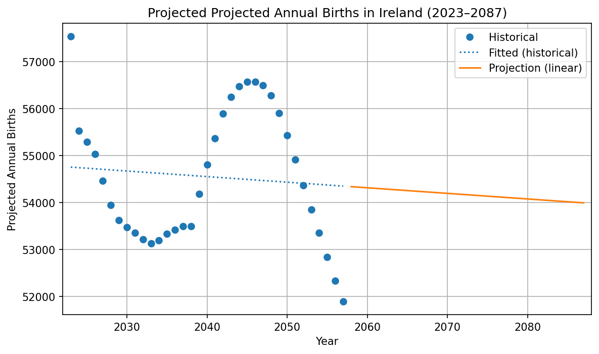

# Programming For Data Analytics — my-work

This README documents the student work inside the `my-work/` folder for the Programming For Data Analytics module. It summarises assignments, code, data, and generated charts, and explains how to reproduce results.

## Contents
- Assignment 1: Projected births
- Assignment 2: Population by age (Galway)
- Lab 4: Regular expressions and log/quiz parsing
- How to run
- Data sources and assumptions
- Dependencies
- Where outputs are saved
- Notes and future improvements

---

## Assignment 1 — Projected births

Files:
- `code/projected_births.py` — script that finds `projectedbirths-cso.csv`, fits a linear model to historical annual counts, projects 30 years forward, and saves a timestamped PNG to `my-work/generated_charts/`.
- `assignments/week01_projected_births_notebook.ipynb` — interactive notebook that walks through the same workflow and saves a timestamped PNG.

How it works (brief):
- Locates the CSV in nearby `data/` or `code/data/` folders.
- Cleans `Year` and the numeric value column (prefers `VALUE`).
- Fits scikit-learn LinearRegression on t = Year - yr0 and projects 30 years ahead.
- Plots historical points, fitted line, and projection segment; saves a timestamped PNG.

Run:
```powershell
cd my-work/code
python .\projected_births.py
```

---

### Example output


Caption: Historical births (points), fitted line (dotted) and linear projection (solid). Output filename is timestamped.


## Assignment 2 — Population by age (Galway)

Files:
- `code/cso_populationbyage_galway.py` — loads `cso-populationbyage.csv`, filters for CensusYear 2022 and the two Galway councils (Galway City Council and Galway County Council), aggregates population by single-year age, plots a coloured bar chart with annotations and a ledger, highlights the dip between ages 20–40, and saves timestamped PNG(s) to `my-work/generated_charts/`.
- `assignments/week01_populationbyage_galway_notebook.ipynb` — interactive notebook that performs the same analysis and saves two PNGs (main plot and highlighted dip).

How it works (brief):
- Finds the CSV using the same local search heuristic.
- Filters to 2022, Both sexes, and the Galway councils; parses 'Single Year of Age' labels.
- Aggregates city + county counts by single-year age and plots Age vs Population.
- Visual features include per-age colouring, a colorbar, numeric annotations every 10 years, a dashed trend line (slope), and a small ledger showing totals and top ages.
- The notebook additionally shades ages 20–40 and computes a simple relative-drop metric compared to neighbouring age bands; it saves a highlighted image.

Run:
```powershell
cd my-work/code
python .\cso_populationbyage_galway.py
```

---

### Galway population main chart — highlighted dip (ages 20–40)


Caption: Population by single-year age for Galway (Galway City Council + Galway County Council). Bars are coloured by age; annotations appear every 10 years and a dashed trend line summarises the age-related slope. Same data with ages 20–40 shaded to emphasise the dip in counts in that band; a small ledger reports summary statistics for the shaded range.

#### Notebook numeric output (Top 5 ages)

Example Top 5 single-year ages (most populous) produced by the Galway notebook. Run the notebook to refresh these numbers.

| Age | Population |
|-----:|-----------:|
| 42 | 4,570 |
| 41 | 4,562 |
| 40 | 4,489 |
| 39 | 4,332 |
| 43 | 4,294 |

---

## How to run

Install prerequisites (if needed):
```powershell
pip install pandas numpy matplotlib scikit-learn
```

General notes:
- Scripts save timestamped PNG files to `my-work/generated_charts/` to avoid overwriting previous outputs. Filenames include the CSV stem and timestamp, e.g. `cso-populationbyage_galway_2025-10-06_122737.png`.
- The notebooks print the resolved output folder when saving.

---

## Data sources and assumptions
- `projectedbirths-cso.csv` and `cso-populationbyage.csv` were sourced from the Central Statistics Office (CSO).
- Scripts expect a `Year` or `CensusYear` column and a numeric `VALUE` column. The population notebook and script parse 'Single Year of Age' labels into integers ("Under 1 year" -> 0).

---

## Dependencies
- pandas
- numpy
- matplotlib
- scikit-learn

Install with `pip install pandas numpy matplotlib scikit-learn`.

---

## Where outputs are saved
All generated plots are saved to `my-work/generated_charts/`. Filenames include a timestamp to avoid accidental overwrite. Example:

`cso-populationbyage_galway_2025-10-06_122737.png`

---

## Output images

The repository saves a few illustrative PNG images under `my-work/generated_charts/`. Example files you may find there:

- `projected_births_YYYY-MM-DD_HHMMSS.png` — plot of historical births and linear projection (Assignment 1).
- `cso-populationbyage_galway_YYYY-MM-DD_HHMMSS.png` — main bar chart of population by single-year age for Galway (Assignment 2).
- `cso-populationbyage_galway_highlight_YYYY-MM-DD_HHMMSS.png` — the same chart with ages 20–40 shaded and a short ledger summarising the relative drop.

These files are produced by the scripts and by the notebook when run.

## Understanding the outputs

Short guidance to interpret the generated images:

- Projected births plot (`projected_births_...png`):
	- Blue points are historical observed values (annual totals).
	- A dotted blue fitted line shows the model fit over the historical years.
	- A solid contrasting line shows the linear projection into the future.
	- Axis limits are chosen to include both historical and projected values; check the legend and title for the projection horizon.

- Galway population by age (`cso-populationbyage_galway_...png`):
	- X axis: single-year ages (0, 1, 2, ...). 'Under 1 year' is shown at age 0.
	- Y axis: population counts for each age (Galway City + County combined, both sexes).
	- Bars are coloured by age (a continuous colormap) and a vertical colorbar shows the age mapping.
	- Numeric annotations are shown above bars every 10 years (0, 10, 20, ...).
	- A dashed red trend line shows a simple linear fit across ages; the legend lists the slope in population per year of age.
	- A small ledger box shows the total population, approximate median age, and the top 5 single-year ages by population.

- Highlighted dip image (`cso-populationbyage_galway_highlight_...png`):
	- The ages 20–40 are shaded to emphasise the observed dip in counts in that band.
	- A small annotation box reports the total population in that range and a simple relative-drop metric compared with neighbouring age bands.

Tips:
- If you want to inspect the underlying numbers, run the notebook cells to produce `top5` and `decade_df` tables or open the CSV inputs in a spreadsheet.
- For reproducible outputs, run the scripts from `my-work/code/` so the CSV search heuristics find the correct data files.


## Lab 4 — Regular expressions and log/quiz parsing

This lab focuses on using Python's regular expressions to search, extract, and transform text in log and sample files. It includes small utilities for testing patterns, anonymising IP addresses, and extracting specific components like timestamps.


Quiz regex patterns (a–l):

What lines will be printed out for the following regular expressions? Note that regular expressions in python are case sensitive: 

```
# List of regex patterns to test
patterns = [
    ("a", "hello"),
    ("b", "Hello"),
    ("c", "^Hello"),
    ("d", "^Hell*o"),
    ("e", "^Hell+o"),
    ("f", "^Hell?o"),
    ("g", "^hello [A-Z]"),
    ("h", "^Hello [A-Z]"),
    ("i", "="),
    ("j", "#"),
    ("k", r"\["),
    ("l", "^$")
]
```

### Output lines depend on the content of `quiz.txt` in `my-work/data/sample-files/`.

```
a. Pattern: 'hello'
--------------------------------------------------
Line 1: hello

b. Pattern: 'Hello'
--------------------------------------------------
Line 2: Hello
Line 3: Hello World
Line 5:        Hello mary

c. Pattern: '^Hello'
--------------------------------------------------
Line 2: Hello
Line 3: Hello World

d. Pattern: '^Hell*o'
--------------------------------------------------
Line 2: Hello
Line 3: Hello World
Line 4: Helo John
Line 6: Helllllllllllo Anamaniacs

e. Pattern: '^Hell+o'
--------------------------------------------------
Line 2: Hello
Line 3: Hello World
Line 6: Helllllllllllo Anamaniacs

f. Pattern: '^Hell?o'
--------------------------------------------------
Line 2: Hello
Line 3: Hello World
Line 4: Helo John

g. Pattern: '^hello [A-Z]'
--------------------------------------------------
(No matches)

h. Pattern: '^Hello [A-Z]'
--------------------------------------------------
Line 3: Hello World

i. Pattern: '='
--------------------------------------------------
Line 7: var = 123

j. Pattern: '#'
--------------------------------------------------
Line 8: change this #this will change

k. Pattern: '\['
--------------------------------------------------
Line 9: what [about] this.

l. Pattern: '^$'
--------------------------------------------------
(No matches)
```

Files:
- `code/lab04_anonymise_ips.py` — anonymises the last two octets of IPv4 addresses in `../data/access.log.txt` by replacing them with `XXX.XXX`; writes output to `../data/lab04_anonymisedIPs.txt`.
- `code/lab04_regex_tests.py` — runs a set of regex patterns over `../data/access.log.txt` to demonstrate matching numbers, IPs, timestamps, query params, etc., and prints sample matches.
- `code/lab04_access_timestamps.py` — extracts date/time tokens like `[15/Feb/2021:18:44:39]` from `../data/access.log.txt` and prints them.
- `code/lab04_quiz_hello_capital.py` — prints lines from `../data/sample-files/quiz.txt` that start with `Hello ` followed by a capital letter.
- `code/lab04_quiz_patterns_test.py` — iterates over a list of regex patterns (a–l), prints matches with line numbers from `../data/sample-files/quiz.txt`, and saves results to `../data/lab04_quiz_results.txt`.
- `code/lab04_test_trailing_digits_regex.py` — sanity-check for the pattern `\d+$` (digits at end of line) on `../data/access.log.txt` with a few diagnostics.
- `code/lab04_access_file_inspect.py` — utility to verify file presence/size and preview content of `../data/access.log.txt`.

How it works (brief):
- Uses Python's `re` module: `search`, `findall`, and `sub` to locate or replace patterns.
- Demonstrates anchors (`^`, `$`), character classes (`\d`, `\w`), quantifiers (`*`, `+`, `?`, `{m,n}`), grouping `()`, and character escaping.
- IP anonymisation uses a capturing group for the first two octets and replaces the last two with placeholders:
	- Pattern: `(\d{1,3}\.\d{1,3}\.)\d{1,3}\.\d{1,3}`
	- Replacement: `\1XXX.XXX`
- Paths are relative to the script location or repository layout; prefer running from `my-work/code/` for consistency.

Run:
```powershell
cd my-work/code
python .\lab04_anonymise_ips.py              # writes ../data/lab04_anonymisedIPs.txt
python .\lab04_regex_tests.py                # prints sample matches for multiple patterns
python .\lab04_access_timestamps.py          # prints extracted [date/time] tokens
python .\lab04_quiz_hello_capital.py         # prints matching lines from quiz.txt
python .\lab04_quiz_patterns_test.py         # writes ../data/lab04_quiz_results.txt
```

Data files used:
- `my-work/data/access.log.txt`
- `my-work/data/sample-files/quiz.txt`

Where outputs are saved (Lab 4):
- `my-work/data/lab04_anonymisedIPs.txt` — anonymised copy of `access.log.txt`.
- `my-work/data/lab04_quiz_results.txt` — collated regex matches from `quiz.txt`.

References and sources:
- W3Schools — Python RegEx: https://www.w3schools.com/python/python_regex.asp
- W3Schools — Python File Handling: https://www.w3schools.com/python/python_file_open.asp
- Lab 4 instructions — ATU course handout/brief ([see Moodle/Blackboard for the specific PDF/URL](https://vlegalwaymayo.atu.ie/pluginfile.php/1590532/mod_resource/content/4/Lab%2004.01%20regex.pdf))
- YouTube — Python regex tutorial: https://www.youtube.com/watch?v=sa-TUpSx1JA

Notes:
- If relative paths fail, use `os.path.join(os.path.dirname(__file__), ...)` as shown in `lab04_quiz_test.py`.
- Remember that regex is case-sensitive by default; use character classes or `re.IGNORECASE` as needed.

---

## Contact
If you need clarifications on the code or data, contact the author (Edward Cronin) at g00425645@atu.ie.
